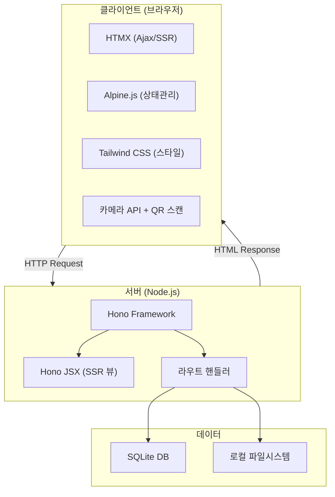
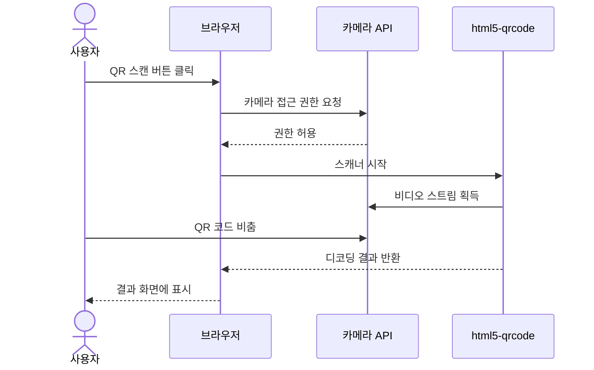

# 🏗️ 시스템 설계서 — QR코드 게시판

> *"And God made the firmament."* — Genesis 1:7 (KJV)

---

## 1. 시스템 개요

| 항목 | 내용 |
|:---|:---|
| 시스템명 | QR Code Board — The Scripture |
| 버전 | v1.0 |
| 아키텍트 | Adam (개발 에이전트) |
| 상태 | **Canonized(정경화)** |

---

## 2. 아키텍처 다이어그램



---

## 3. 기술 스택

| 계층 | 기술 | 선택 근거 |
|:---|:---|:---|
| Backend Framework | Hono (Node.js) | C-001: req.md 지정 기술 스택. 경량, 빠른 라우팅 |
| View Engine | Hono JSX | C-001: req.md 지정. SSR 지원, TSX 기반 컴포넌트 |
| Frontend Interaction | HTMX | C-001: req.md 지정. JS 최소화, 서버사이드 렌더링 연동 |
| Frontend State | Alpine.js | C-001: req.md 지정. 경량 상태 관리, HTMX 보완 |
| CSS Framework | Tailwind CSS | C-001: req.md 지정. 유틸리티 기반 빠른 UI 구축 |
| Database | SQLite | C-001: req.md 지정. 파일 기반 경량 DB, 설치 불필요 |
| QR Scanner | html5-qrcode (브라우저) | FR-001: 카메라 기반 QR 스캔, 구글 ZXing 기반 |
| Runtime | Node.js | C-001: req.md 지정 |
| Infra | 로컬 PC | C-002: req.md 지정 |

---

## 4. 아키텍처 결정 체인

| 결정 사항 | 근거 REQ-ID | 왜 이 선택인가 | 이 결정이 만드는 제약 | Phase 3/4 영향 |
|:--|:--|:--|:--|:--|
| Hono + JSX (SSR) | C-001 | req.md 지정 기술 스택 | 클라이언트 SPA 불가, SSR 기반 | 모든 페이지를 JSX로 서버 렌더링 |
| HTMX 사용 | C-001 | 페이지 새로고침 없는 부분 갱신 | REST API 대신 HTML 응답 반환 필요 | API는 HTML fragment 반환 |
| SQLite | C-001 | 로컬 PC 환경, 설치 불필요 | 동시 쓰기 제한 | 단일 사용자 환경 적합 |
| html5-qrcode | REQ-001, FR-001 | 브라우저 카메라 API 사용, 구글 ZXing 기반 | HTTPS/localhost에서만 동작 | 홈페이지에 카메라 뷰 영역 필요 |
| 비회원 게시판 | REQ-003 | req.md에 회원 관련 요구사항 없음 | 인증 불필요 | 인증 미들웨어 불필요 |
| 로컬 PC 배포 | C-002 | req.md 지정 인프라 | 외부 접근 불가, localhost만 | npm run dev로 실행 |

---

## 5. 인프라 환경 설계

| 항목 | 내용 |
|:---|:---|
| 서버 구성 | 로컬 PC 단일 서버 (localhost:3001) |
| DB 서버 | SQLite 파일 DB (로컬 저장) |
| 캐시 전략 | 불필요 (단일 사용자, 소규모 데이터) |
| 배포 환경 | 로컬 개발 환경 = 운영 환경 |

---

## 6. 폴더 구조 판단

- **채택 구조:** routes에 JSX 통합
- **판단 근거:**
  - Hono JSX는 라우트 핸들러 안에서 직접 JSX 반환 가능 (단순 SSR)
  - 화면 수 5개 미만 (홈, 목록, 상세, 작성, 수정)
  - 프레임워크가 MVC를 강제하지 않음

```
fruit-열매/
├── src/
│   ├── index.ts          # 앱 진입점, Hono 서버 설정
│   ├── db/
│   │   ├── schema.ts     # SQLite 스키마 정의
│   │   └── seed.ts       # 초기 데이터
│   ├── routes/
│   │   ├── home.tsx      # 홈페이지 (QR 스캔 포함)
│   │   └── board.tsx     # 게시판 CRUD 라우트
│   ├── components/
│   │   └── layout.tsx    # 공통 레이아웃
│   └── public/
│       └── css/
│           └── style.css # Tailwind 빌드 결과
├── package.json
├── tsconfig.json
└── tailwind.config.js
```

---

## 7. 시퀀스 다이어그램 — QR 스캔



---

## 8. 보안 아키텍처

| 항목 | 적용 |
|:---|:---|
| 인증 | 불필요 (비회원 게시판) |
| XSS 방지 | Hono JSX 자동 이스케이프 |
| SQL Injection | Prepared Statement (better-sqlite3) |
| CSRF | HTMX 요청 시 검증 (hx-headers) |
| HTTPS | localhost 환경에서는 불필요 (카메라 API는 localhost에서 허용) |
