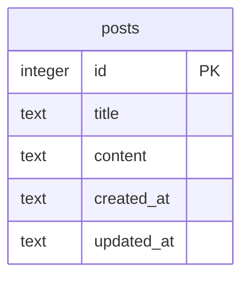

# 🏛️ 데이터 설계서 — QR코드 게시판

> *"And thou shalt make an ark of shittim wood ... And thou shalt put into the ark the testimony which I shall give thee."* — Exodus 25:10,16 (KJV)

---

## 1. 데이터 아키텍처 개요

| 항목 | 내용 |
|:---|:---|
| DBMS | SQLite 3 (better-sqlite3) |
| 스키마 전략 | 단일 파일 DB (./data/board.db) |
| 테이블 네이밍 | snake_case, 복수형 |
| 컬럼 네이밍 | snake_case |

---

## 2. ERD



> 단일 게시판, 비회원 구조이므로 posts 테이블 1개로 구성.

---

## 3. 테이블 정의서

### TBL-001: posts (게시글)

> **목적:** 게시판 게시글 데이터 저장 — 사용자가 작성한 게시글의 제목, 내용, 시간 정보 보관
> **연결 REQ:** REQ-003, FR-004, FR-005, FR-006, FR-007, FR-008

| # | 컬럼명 | 타입 | NULL | PK | FK | Default | 설명 |
|:--|:---|:---|:---:|:---:|:---|:---|:---|
| 1 | id | INTEGER | ❌ | ✅ | — | AUTOINCREMENT | 기본키 |
| 2 | title | TEXT | ❌ | — | — | — | 게시글 제목 |
| 3 | content | TEXT | ❌ | — | — | — | 게시글 내용 |
| 4 | created_at | TEXT | ❌ | — | — | CURRENT_TIMESTAMP | 생성일시 (ISO 8601) |
| 5 | updated_at | TEXT | ❌ | — | — | CURRENT_TIMESTAMP | 수정일시 (ISO 8601) |

**인덱스:**
| 인덱스명 | 컬럼 | 유형 | 사유 |
|:---|:---|:---|:---|
| idx_posts_created_at | created_at | BTREE | 목록 조회 시 최신순 정렬 |

**제약조건:**
- NOT NULL: title, content — 빈 게시글 방지
- CHECK: length(title) > 0 — 빈 제목 방지

---

## 4. DDL

```sql
CREATE TABLE IF NOT EXISTS posts (
    id INTEGER PRIMARY KEY AUTOINCREMENT,
    title TEXT NOT NULL CHECK(length(title) > 0),
    content TEXT NOT NULL,
    created_at TEXT NOT NULL DEFAULT (datetime('now', 'localtime')),
    updated_at TEXT NOT NULL DEFAULT (datetime('now', 'localtime'))
);

CREATE INDEX IF NOT EXISTS idx_posts_created_at ON posts(created_at DESC);
```

---

## 5. 공통 코드 정의

본 프로젝트는 단일 게시판, 비회원 구조로 공통 코드가 불필요하다.
향후 게시글 상태 관리(공개/비공개 등)가 추가될 경우 코드 테이블을 도입한다.

---

## 6. 인덱스 전략

| 쿼리 패턴 | 인덱스 | 사유 |
|:---|:---|:---|
| 게시판 목록 (최신순) | idx_posts_created_at DESC | FR-004: 목록을 최신순으로 조회 |
| 게시글 상세 | PRIMARY KEY (id) | FR-006: id로 직접 조회 |

---

## 7. 데이터 무결성 규칙

| 규칙 | 적용 |
|:---|:---|
| NOT NULL | title, content — 빈 게시글 방지 |
| CHECK | length(title) > 0 — 제목 빈 문자열 방지 |
| PK | id — AUTOINCREMENT로 유일성 보장 |

> FK 관계: 단일 테이블이므로 FK 없음. 테이블 추가 시 반드시 FK 정의할 것.
