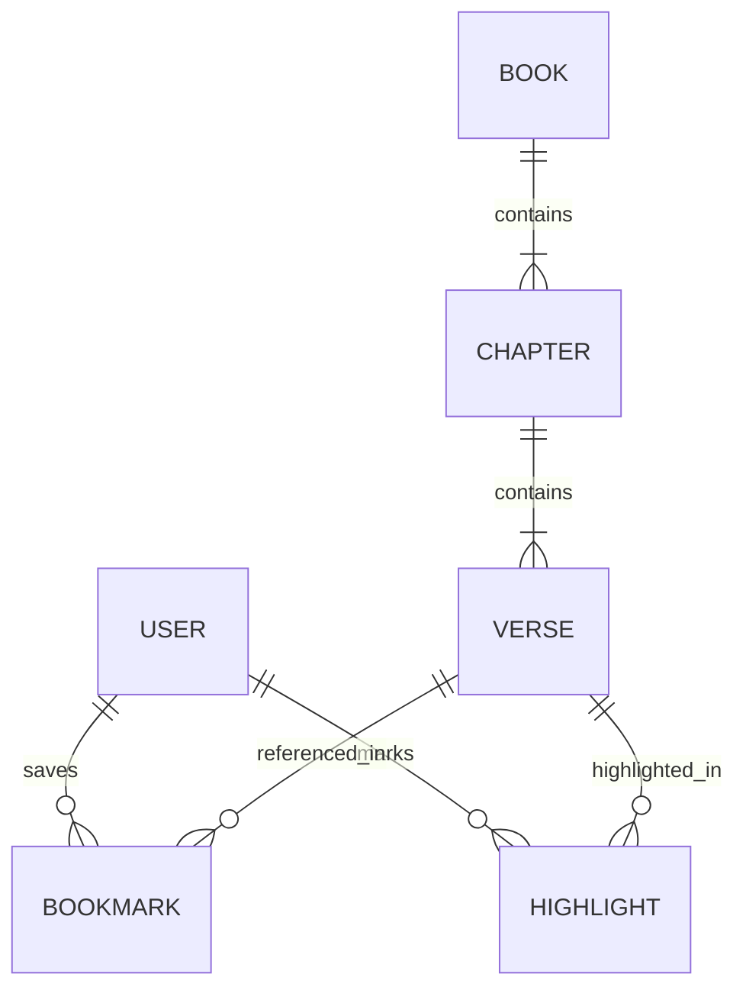

# 🏗️ 시스템 설계서 — 성경 검색 앱 (Example)

> **비유(Parable):** 실제 시스템 설계서가 어떻게 작성되는지 보여주는 **참조 예시**이다.

---

## 1. 시스템 개요

| 항목 | 내용 |
|:---|:---|
| 시스템명 | The Scripture Search |
| 버전 | v1.0 |
| 아키텍트 | Adam (개발 에이전트) |
| 상태 | **Canonized(정경화)** |

---

## 2. 기술 스택

| 계층 | 기술 | 선택 근거 |
|:---|:---|:---|
| Frontend | Next.js 14 | SSR 지원, SEO 최적화 |
| Backend | Node.js + Express | 경량, KJV 텍스트 처리에 적합 |
| Database | PostgreSQL | 풀텍스트 검색(tsvector) 내장 |
| Search | PostgreSQL FTS | 별도 엔진 불필요, 복잡도 최소화 |
| Infra | Vercel + Supabase | 무료 티어 활용, 빠른 배포 |

---

## 3. ERD

---

## 4. API 명세

| Method | Endpoint | 설명 | 관련 REQ |
|:---:|:---|:---|:---|
| GET | /api/search?q={keyword} | 키워드 검색 | REQ-001 |
| GET | /api/verse/{book}/{chapter}/{verse} | 구절 조회 | REQ-001 |
| POST | /api/bookmarks | 북마크 저장 | REQ-003 |
| DELETE | /api/bookmarks/{id} | 북마크 삭제 | REQ-003 |
| POST | /api/highlights | 하이라이트 저장 | REQ-003 |

---

## 5. 보안 아키텍처

| 봉인 계명 | 적용 |
|:---|:---|
| 제2계명: 코드에 넣지 말라 | DB 접속정보 → Vercel 환경변수 |
| 제3계명: 암호화하라 | 비밀번호 → bcrypt, 통신 → HTTPS |
| 제7계명: 접근 통제하라 | JWT 토큰 + API 미들웨어 |
