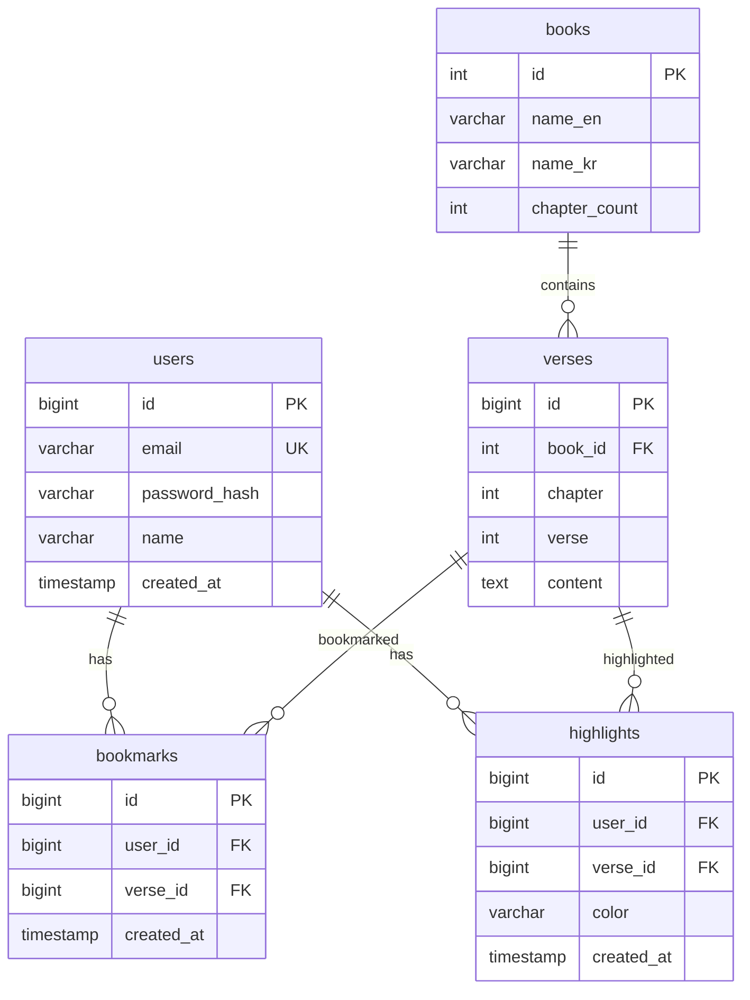

# 🏛️ 데이터 설계서 — 성경 검색 앱 (Example)

> **비유(Parable):** 이 문서는 실제 프로젝트에서 데이터 설계서가 어떻게 작성되는지 보여주는 **참조 예시**이다.
> 실제 산출물 작성 시 이것을 참고하고, 규격은 `statute-율법/02/data-ark-법궤-template.md`를 따르라.

---

## 1. 데이터 아키텍처 개요

| 항목 | 내용 |
|:---|:---|
| DBMS | PostgreSQL 16 |
| 스키마 전략 | 단일 스키마 (public) |
| 테이블 네이밍 | snake_case, 복수형 |
| 컬럼 네이밍 | snake_case |

---

## 2. ERD

---

## 3. 테이블 정의서

### TBL-001: users (사용자)

> **목적:** 회원 계정 정보 관리
> **연결 REQ:** REQ-002

| # | 컬럼명 | 타입 | NULL | PK | FK | Default | 설명 |
|:--|:---|:---|:---:|:---:|:---|:---|:---|
| 1 | id | BIGINT | ❌ | ✅ | — | AUTO_INCREMENT | 기본키 |
| 2 | email | VARCHAR(255) | ❌ | — | — | — | 이메일 (Unique) |
| 3 | password_hash | VARCHAR(255) | ❌ | — | — | — | 암호화된 비밀번호 |
| 4 | name | VARCHAR(50) | ❌ | — | — | — | 사용자 이름 |
| 5 | created_at | TIMESTAMP | ❌ | — | — | CURRENT_TIMESTAMP | 가입일시 |
| 6 | updated_at | TIMESTAMP | ❌ | — | — | CURRENT_TIMESTAMP | 수정일시 |

**인덱스:**
| 인덱스명 | 컬럼 | 유형 | 사유 |
|:---|:---|:---|:---|
| idx_users_email | email | UNIQUE BTREE | 로그인 시 이메일 조회 |

**제약조건:**
- UNIQUE: email

### TBL-002: verses (구절)

> **목적:** KJV 성경 66권 전문 저장
> **연결 REQ:** REQ-001

| # | 컬럼명 | 타입 | NULL | PK | FK | Default | 설명 |
|:--|:---|:---|:---:|:---:|:---|:---|:---|
| 1 | id | BIGINT | ❌ | ✅ | — | AUTO_INCREMENT | 기본키 |
| 2 | book_id | INT | ❌ | — | TBL-003.id | — | 성경 책 참조 |
| 3 | chapter | INT | ❌ | — | — | — | 장 번호 |
| 4 | verse | INT | ❌ | — | — | — | 절 번호 |
| 5 | content | TEXT | ❌ | — | — | — | 구절 본문 (KJV) |

**인덱스:**
| 인덱스명 | 컬럼 | 유형 | 사유 |
|:---|:---|:---|:---|
| idx_verses_book_chapter | book_id, chapter | BTREE | 장 단위 조회 |
| idx_verses_content_ft | content | GIN (Full-Text) | 키워드 검색 |

**제약조건:**
- UNIQUE: (book_id, chapter, verse) — 같은 구절 중복 금지

---

## 4. 공통 코드 정의

| CODE-ID | 코드 그룹 | 코드 | 값 | 설명 |
|:---|:---|:---|:---|:---|
| CODE-001 | 하이라이트 색상 | YELLOW | #FFEB3B | 기본 하이라이트 |
| CODE-001 | 하이라이트 색상 | GREEN | #4CAF50 | 녹색 하이라이트 |
| CODE-001 | 하이라이트 색상 | BLUE | #2196F3 | 파랑 하이라이트 |
| CODE-001 | 하이라이트 색상 | RED | #F44336 | 빨강 하이라이트 |
