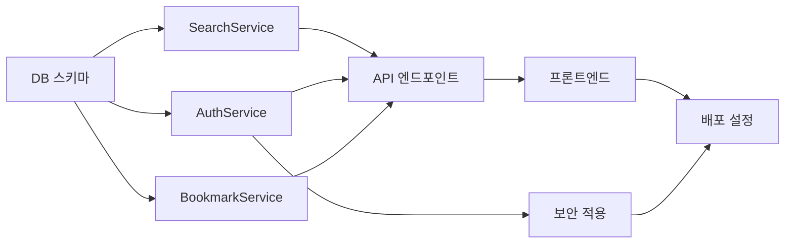

# 🧱 개발 태스크 전략 — 성경 검색 앱 (Example)

> **비유(Parable):** 이 문서는 실제 프로젝트에서 태스크 전략이 어떻게 작성되는지 보여주는 **참조 예시**이다.
> 실제 산출물 작성 시 이것을 참고하고, 규격은 `statute-율법/04/task-wall-성벽-template.md`를 따르라.

---

## 구현 순서 (느헤미야의 성벽 재건 순서)

```
1단계: 기반 — DB 스키마 생성 (books, verses, users, bookmarks, highlights)
  ↓
2단계: 핵심 — SearchService, AuthService, BookmarkService
  ↓
3단계: 성문 — API 엔드포인트 6개
  ↓
4단계: 외벽 — 프론트엔드 (검색 화면, 구절 상세, 로그인)
  ↓
5단계: 봉인 — JWT 인증, 비밀번호 암호화
  ↓
6단계: 파수꾼 — Docker, CI/CD
```

---

## 태스크 분할표

| TASK-ID | 성벽 구간 | 설명 | 연결 REQ | 연결 API/TBL | 선행 태스크 | 규모 | 상태 |
|:---|:---|:---|:---|:---|:---|:---:|:---:|
| TASK-001 | DB 스키마 | books, verses, users 테이블 생성 + KJV 시드 | REQ-001,002 | TBL-001~003 | — | M | ✅ |
| TASK-002 | SearchService | 키워드 검색 + 구절 조회 로직 | REQ-001 | API-001,002 / TBL-002 | TASK-001 | M | ✅ |
| TASK-003 | AuthService | 회원가입/로그인 + JWT 발급 | REQ-002 | API-003,004 / TBL-001 | TASK-001 | M | ✅ |
| TASK-004 | BookmarkService | 북마크 추가/삭제/목록 | REQ-003 | API-005,006 / TBL-004 | TASK-001 | S | ✅ |
| TASK-005 | API 엔드포인트 | 6개 API Controller + Router | REQ-001~003 | API-001~006 | TASK-002,003,004 | M | ✅ |
| TASK-006 | 프론트엔드 | 검색 화면, 구절 상세, 로그인 | REQ-001~003 | — | TASK-005 | L | ✅ |
| TASK-007 | 보안 적용 | JWT 미들웨어, bcrypt | REQ-002 | — | TASK-003 | S | ✅ |
| TASK-008 | 배포 설정 | Dockerfile, docker-compose | — | — | TASK-006,007 | S | ✅ |

### TASK-006 서브 태스크 (L 규모 분할)

| TASK-ID | 서브 태스크 | 설명 | 상태 |
|:---|:---|:---|:---:|
| TASK-006 | 전체: 프론트엔드 | 3개 주요 화면 | ✅ |
| TASK-006-1 | 검색 화면 | 검색창 + 결과 목록 | ✅ |
| TASK-006-2 | 구절 상세 화면 | 본문 표시 + 북마크/하이라이트 버튼 | ✅ |
| TASK-006-3 | 로그인/회원가입 화면 | 폼 + 유효성 검증 | ✅ |

---

## 태스크 의존성 맵



> ✅ 8개 태스크, 52일 아닌 **성벽 재건 완료**. 느헤미야의 원칙대로 구간을 나누어 쌓았다.
