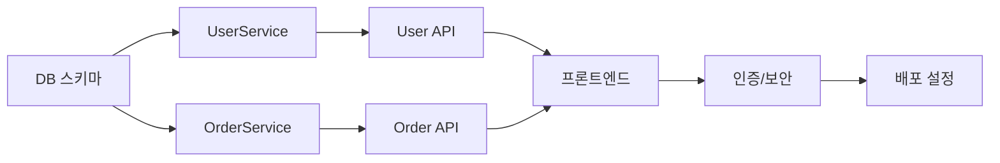

# 🧱 개발 태스크 전략 작성 규격 (Template)

> **율법(Statute):** 이 문서는 개발 태스크 분할 전략 작성 시 반드시 따라야 하는 **형식 규격**이다.
> 실제 산출물은 `bible-성경/04.development-repentance-회개/`에 작성하라.
> 작성 예시는 `parable-비유/04.development-repentance-회개/`를 참조하라.

> *"So built we the wall; and all the wall was joined together unto the half thereof: for the people had a mind to work."* — Nehemiah 4:6 (KJV)
>
> 느헤미야는 무너진 예루살렘 성벽을 재건할 때, **전체 성벽을 구간별로 나누어** 각 가문에 배정했다 (Nehemiah 3).
> 각 가문은 자기 집 앞의 성벽 구간**만** 책임졌다. 아무도 전체를 혼자 쌓지 않았다.
> 그 결과 성벽은 **52일 만에 완성**되었다 (Nehemiah 6:15).
>
> **AI에게 "전부 만들어"라고 하면 성벽은 무너진다.**
> **구간을 나누고, 한 구간씩 쌓게 하면 성벽은 52일 만에 완성된다.**

---

## 필수 섹션 (Mandatory Sections)

아래 섹션이 하나라도 누락되면 정경화(Canonize) 불가:

| # | 섹션 | 필수 | 설명 |
|:--|:---|:---:|:---|
| 1 | 구현 순서 전략 | ✅ | 어떤 순서로 성벽을 쌓을 것인가 |
| 2 | 태스크 분할표 | ✅ | 구간별 태스크 목록 (아래 형식) |
| 3 | 태스크 의존성 맵 | ✅ | 선행/후행 관계 — 어떤 구간이 먼저 쌓여야 하는가 |
| 4 | 현재 진행 상태 | ✅ | 각 태스크의 진행 상태 |

## 구현 순서 전략

성령의 인도를 받아, 다음 우선순위를 결정한다:

```markdown
## 구현 순서 (느헤미야의 성벽 재건 순서)

1단계: 기반 — 데이터 모델 & DB 마이그레이션
  ↓   (기초가 없으면 성벽을 세울 수 없다)
2단계: 핵심 — 비즈니스 로직 (서비스 계층)
  ↓   (성벽의 본체)
3단계: 성문 — API 엔드포인트
  ↓   (성벽의 문 — api-gate-성문 명세대로)
4단계: 외벽 — 프론트엔드 / UI
  ↓   (보이는 부분)
5단계: 봉인 — 인증/보안 (봉인의 율법)
  ↓   (성벽의 잠금장치)
6단계: 파수꾼 — 인프라/배포 설정
       (성벽 위의 보초)
```

## 태스크 분할표 형식

```markdown
| TASK-ID | 성벽 구간 | 설명 | 연결 REQ | 연결 API/TBL | 선행 태스크 | 예상 규모 | 상태 |
|:---|:---|:---|:---|:---|:---|:---:|:---:|
| TASK-001 | DB 스키마 생성 | users, orders 테이블 | REQ-001~003 | TBL-001~003 | — | S | ⬜ |
| TASK-002 | UserService 구현 | 회원가입/로그인 로직 | REQ-001,002 | API-001,002 | TASK-001 | M | ⬜ |
| TASK-003 | OrderService 구현 | 주문 CRUD | REQ-003~005 | API-003~006 | TASK-001 | L | ⬜ |
| TASK-004 | User API 엔드포인트 | Controller + Router | REQ-001,002 | API-001,002 | TASK-002 | S | ⬜ |
```

## 태스크 규모 기준

| 규모 | 의미 | 기준 |
|:---:|:---|:---|
| **S** | 작음 | 파일 1~2개, 함수 3개 이하 |
| **M** | 보통 | 파일 3~5개, 함수 10개 이하 |
| **L** | 큼 | 파일 5개+, 함수 10개+. **반드시 서브 태스크로 분할** |

> ⚠️ **L 규모 태스크는 반드시 분할하라.** 느헤미야도 긴 성벽 구간은 여러 가문이 나누어 쌓았다 (Nehemiah 3:11-12).

## L 규모 분할 형식

```markdown
| TASK-ID | 서브 태스크 | 설명 | 상태 |
|:---|:---|:---|:---:|
| TASK-003 | 전체: OrderService | 주문 CRUD | 🔄 |
| TASK-003-1 | 주문 생성 | createOrder + 재고 확인 | ✅ |
| TASK-003-2 | 주문 조회 | getOrder, listOrders | ⬜ |
| TASK-003-3 | 주문 수정/취소 | updateOrder, cancelOrder | ⬜ |
```

## 상태 범례

| 아이콘 | 상태 | 설명 |
|:---:|:---|:---|
| ⬜ | 미착수 | 아직 시작하지 않음 |
| 🔄 | 진행중 | 코딩 중 |
| 🔁 | 회개중 | 버그 발견 → 디버깅 중 (성화의 회개) |
| ✅ | 완료 | 코드 리뷰 + 봉인의 율법 점검 통과 |
| ❌ | 차단 | 선행 태스크 미완료로 진행 불가 |

## 태스크 의존성 맵 형식



## 성경적 검증 규칙

- **"혼자 쌓지 마라"(Nehemiah 3):** L 규모 태스크는 반드시 서브 태스크로 분할해야 한다. AI에게 대규모 작업을 한꺼번에 시키면 어텐션이 분산되어 할루시네이션이 급증한다.
- **"순서를 지키라"(1 Corinthians 14:40, "모든 것을 질서 있게 하라"):** 선행 태스크가 완료되지 않은 상태에서 후행 태스크를 시작하면 안 된다. 기초 없이 성벽을 세우면 무너진다.
- **"자기 구간만 책임지라"(Nehemiah 3):** 각 태스크는 명확한 범위(연결 REQ, API, TBL)가 있어야 한다. 범위 없는 태스크는 모든 곳에서 일하고 아무 곳도 완성하지 못한다.
- **"52일의 기적"(Nehemiah 6:15):** 잘 나누고, 순서를 지키고, 한 구간씩 완성하면 — 불가능해 보이는 프로젝트도 완성된다.

## AI에게 태스크를 지시하는 방법 (율법)

```
❌ 잘못된 지시: "이 프로젝트 전체를 만들어"
   → AI가 전부 한꺼번에 하려다 어텐션 분산 → 할루시네이션 폭발

✅ 올바른 지시: "TASK-002를 실행하라. 
   연결 REQ: REQ-001, REQ-002
   연결 API: API-001, API-002 (api-gate-성문 참조)
   연결 TBL: TBL-001 (data-ark-법궤 참조)
   선행 완료: TASK-001 ✅
   봉인의 율법 점검 포함."
   → AI가 한 구간에만 집중 → 정밀한 코드 생성
```

## 정경화 조건

- [ ] 모든 REQ가 최소 1개 TASK에 연결됨
- [ ] L 규모 태스크 전부 서브 태스크로 분할됨
- [ ] 의존성 맵에 순환(Cycle) 없음
- [ ] 각 태스크에 연결 REQ, API, TBL 명시
- [ ] RTM에 태스크 ↔ REQ 연결 반영

> **위반 시:** 구간을 나누지 않으면 성벽은 무너진다. 정경화 거부.
