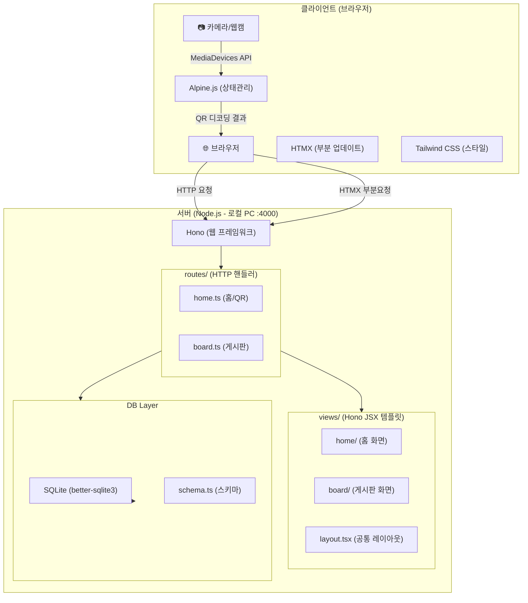
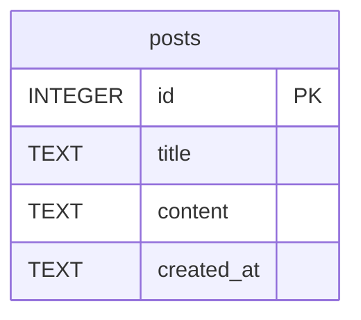
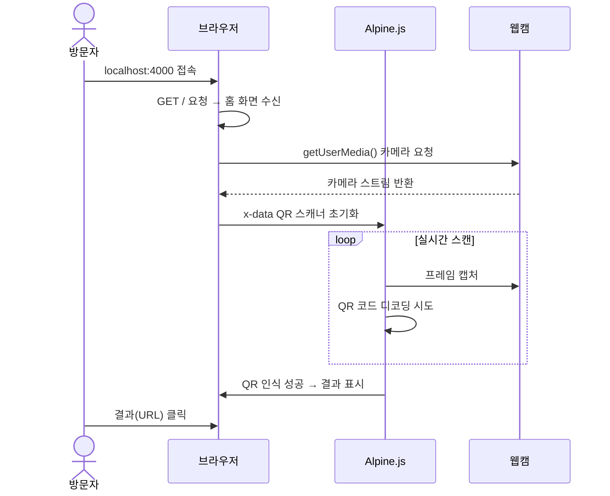
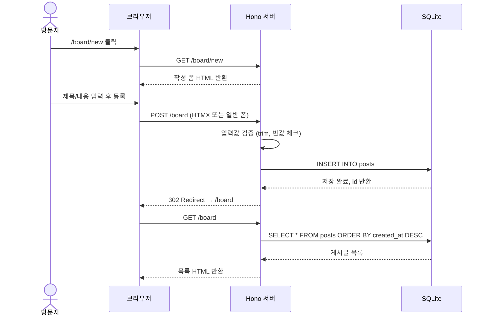

# 🏗️ 시스템 설계서 — QR코드 게시판 (The Scripture)

> **bible-성경/02.architecture-foundation-기초/architecture-temple-성전설계.md**

---

## 1. 시스템 개요

| 항목 | 내용 |
|:---|:---|
| 시스템명 | QR코드 게시판 (qrCodeBoard_TheScripture) |
| 버전 | v1.0 |
| 아키텍트 | Adam (개발 에이전트) |
| 작성일 | 2026-06-03 |
| 상태 | **Canonized(정경화)** |

---

## 2. 아키텍처 다이어그램



---

## 3. 기술 스택

### 아키텍처 결정 체인

| 결정 사항 | 근거 REQ-ID | 왜 이 선택인가 | 이 결정이 만드는 제약 | Phase 3/4 영향 |
|:--|:--|:--|:--|:--|
| Node.js + Hono | NFR-004 (req.md 명시) | Hono: 경량 웹프레임워크, JSX 지원 | 서버사이드 렌더링 중심 구조 | 라우터 분리 필수 |
| Hono JSX | NFR-004 | 서버사이드 JSX 렌더링, Hono 네이티브 | .tsx 확장자 사용, tsconfig 필요 | views/ 폴더에 .tsx 파일 |
| HTMX | NFR-004 | 서버 중심 UI 업데이트, JS 최소화 | 폼 제출/목록 새로고침 HTMX 패턴 | hx-post, hx-get 속성 사용 |
| Alpine.js | NFR-004 (QR 스캔 상태관리) | REQ-001 QR 스캔 클라이언트 상태 관리 | x-data로 상태 선언 | QR 스캐너 컴포넌트 |
| Tailwind CSS | NFR-004 | 유틸리티 CSS, CDN 사용 가능 | CDN 방식 또는 PostCSS 빌드 | 클래스 기반 스타일링 |
| SQLite (better-sqlite3) | NFR-002, C-002 | 로컬 PC, 외부 DB 불필요, 동기 API | 파일 기반 DB, 단일 파일 | DB 경로 설정 필요 |
| 포트 4000 | C-003 | autoRun 지시사항 | .env 또는 하드코딩 | 개발 서버 설정 |

---

| 계층 | 기술 | 버전 | 선택 근거 |
|:---|:---|:---|:---|
| 런타임 | Node.js | LTS (22.x) | req.md 명시 |
| 웹프레임워크 | Hono | 최신 | req.md 명시, JSX 내장 |
| 템플릿 | Hono JSX | Hono 내장 | SSR + TypeScript |
| UI 동적 | HTMX | CDN | 서버 부분 렌더링 |
| 상태관리 | Alpine.js | CDN | QR 스캔 상태 관리 |
| CSS | Tailwind CSS | CDN | req.md 명시 |
| DB | SQLite | better-sqlite3 | req.md 명시, 로컬 |
| QR 스캔 | html5-qrcode | npm | 웹캠 QR 인식 라이브러리 |
| 언어 | TypeScript | 5.x | Hono 네이티브 지원 |

---

## 4. 폴더 구조 판단

### 판단 체크리스트

| # | 질문 | 답변 | 결과 |
|:--|:---|:---|:---|
| 1 | CRUD가 포함되어 있는가? | ✅ YES (게시판: 목록/상세/작성) | 분리 강제 |
| 2 | 화면 수는 몇 개인가? | 홈(1) + 게시판목록(1) + 게시판상세(1) + 게시판작성(1) = **4개** | 분리 필수 |
| 3 | 한 파일에 HTTP처리+렌더링이 섞이는가? | ✅ YES (Hono handler에서 jsx 반환 시) | 분리 필수 |

### 판단 결과
- **채택 구조:** `routes/` (HTTP 처리) + `views/` (Hono JSX 렌더링) **분리**
- **판단 근거:** CRUD 포함 + 화면 4개 → CRUD 강제 분리 규칙 적용
- **파일 목록:**
  - HTTP 처리: `src/routes/home.ts`, `src/routes/board.ts`
  - 렌더링: `src/views/layout.tsx`, `src/views/home/index.tsx`, `src/views/board/list.tsx`, `src/views/board/detail.tsx`, `src/views/board/form.tsx`
  - DB: `src/db/schema.ts`, `src/db/index.ts`

### 최종 폴더 구조

```
fruit-열매/
├── package.json
├── tsconfig.json
├── src/
│   ├── index.ts              # 서버 진입점 (포트 4000)
│   ├── routes/
│   │   ├── home.ts           # GET / (홈, QR 스캐너)
│   │   └── board.ts          # GET /board, GET /board/:id, GET /board/new, POST /board
│   ├── views/
│   │   ├── layout.tsx        # 공통 레이아웃
│   │   ├── home/
│   │   │   └── index.tsx     # 홈 화면 (QR 스캐너 포함)
│   │   └── board/
│   │       ├── list.tsx      # 게시판 목록
│   │       ├── detail.tsx    # 게시글 상세
│   │       └── form.tsx      # 게시글 작성 폼
│   └── db/
│       ├── index.ts          # DB 초기화, 연결
│       └── schema.ts         # 테이블 생성 SQL
└── data/
    └── app.db                # SQLite DB 파일 (자동 생성)
```

---

## 5. 데이터 아키텍처 (ERD 요약)



> 상세 ERD는 `data-ark-법궤.md` 참조

---

## 6. API 명세 (요약)

| API-ID | Method | Endpoint | 설명 | 연결 REQ |
|:---|:---|:---|:---|:---|
| API-001 | GET | / | 홈페이지 (QR 스캐너) | REQ-003 |
| API-002 | GET | /board | 게시판 목록 | REQ-004 |
| API-003 | GET | /board/:id | 게시글 상세 | REQ-006 |
| API-004 | GET | /board/new | 게시글 작성 폼 | REQ-005 |
| API-005 | POST | /board | 게시글 저장 | REQ-005 |

> 상세 API 명세는 `api-gate-성문.md` 참조

---

## 7. 시퀀스 다이어그램

### QR 스캔 흐름 (UC-002)



### 게시글 작성 흐름 (UC-005)



---

## 8. 보안 아키텍처

| 계층 | 방어 항목 | 구현 방법 |
|:---|:---|:---|
| 클라이언트 | 입력값 검증 | HTML `required` 속성, 프론트 trim |
| 서버 | 입력값 검증 | `trim()` + 빈값 체크 (board.ts) |
| 서버 | XSS 방지 | Hono JSX 자동 이스케이프 |
| DB | 빈값 방어 | `CHECK(length(trim(title)) > 0)` |
| DB | SQL Injection 방지 | better-sqlite3 Prepared Statement |
| 카메라 | 권한 동의 | `getUserMedia()` 브라우저 권한 요청 |

---

## ARCH-ID 목록

| ARCH-ID | 컴포넌트 | 연결 REQ |
|:---|:---|:---|
| ARCH-001 | 홈 라우터 (home.ts) | REQ-003 |
| ARCH-002 | 게시판 라우터 (board.ts) | REQ-004, REQ-005, REQ-006 |
| ARCH-003 | QR 스캐너 컴포넌트 (Alpine.js) | REQ-001, REQ-002 |
| ARCH-004 | DB 레이어 (schema.ts, index.ts) | REQ-004, REQ-005, REQ-006 |
| ARCH-005 | 공통 레이아웃 (layout.tsx) | REQ-003 |
