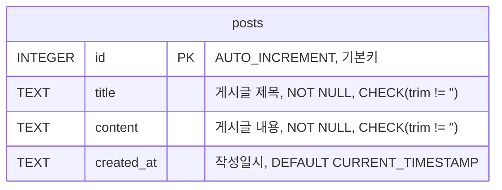

# 🏛️ 데이터 설계서 (법궤) — QR코드 게시판 (The Scripture)

> **bible-성경/02.architecture-foundation-기초/data-ark-법궤.md**

---

## 1. 데이터 아키텍처 개요

| 항목 | 내용 |
|:---|:---|
| DBMS | SQLite (better-sqlite3) |
| DB 파일 경로 | `fruit-열매/data/app.db` |
| 스키마 전략 | 애플리케이션 시작 시 자동 생성 (CREATE TABLE IF NOT EXISTS) |
| 네이밍 규칙 | snake_case, 테이블 복수형 |
| 문자셋 | UTF-8 (SQLite 기본) |

---

## 2. ERD (엔티티 관계도)



> **설계 근거:** req.md "게시판 1개" → 1개 테이블. 로그인 없음 → user_id 불필요.
> 향후 기능 추가(수정/삭제)를 위해 updated_at 추가.

---

## 3. 테이블 정의서

### TBL-001: posts (게시글)

> **목적:** 게시판의 게시글을 저장하는 테이블
> **연결 REQ:** REQ-004, REQ-005, REQ-006

| # | 컬럼명 | 타입 | NULL | PK | FK | Default | 설명 |
|:--|:---|:---|:---:|:---:|:---|:---|:---|
| 1 | id | INTEGER | ❌ | ✅ | — | AUTOINCREMENT | 기본키 |
| 2 | title | TEXT | ❌ | — | — | — | 게시글 제목 |
| 3 | content | TEXT | ❌ | — | — | — | 게시글 내용 |
| 4 | created_at | TEXT | ❌ | — | — | CURRENT_TIMESTAMP | 작성일시 (ISO 8601) |
| 5 | updated_at | TEXT | ❌ | — | — | CURRENT_TIMESTAMP | 수정일시 (ISO 8601) |

**DDL:**
```sql
CREATE TABLE IF NOT EXISTS posts (
  id         INTEGER PRIMARY KEY AUTOINCREMENT,
  title      TEXT    NOT NULL CHECK(length(trim(title)) > 0),
  content    TEXT    NOT NULL CHECK(length(trim(content)) > 0),
  created_at TEXT    NOT NULL DEFAULT (datetime('now', 'localtime')),
  updated_at TEXT    NOT NULL DEFAULT (datetime('now', 'localtime'))
);
```

**인덱스:**
| 인덱스명 | 컬럼 | 유형 | 사유 |
|:---|:---|:---|:---|
| idx_posts_created_at | created_at | BTREE | 목록 최신순 정렬 조회 |

**제약조건:**
- CHECK: `length(trim(title)) > 0` — 빈 제목 방지 (방어 깊이 3번째 층)
- CHECK: `length(trim(content)) > 0` — 빈 내용 방지 (방어 깊이 3번째 층)

---

## 4. 공통 코드 정의

| CODE-ID | 구분 | 코드 | 설명 |
|:---|:---|:---|:---|
| CODE-001 | HTTP 에러 | 400 | 잘못된 요청 (입력값 오류) |
| CODE-002 | HTTP 에러 | 404 | 게시글 없음 |
| CODE-003 | HTTP 에러 | 500 | 서버 내부 오류 |

---

## 5. 인덱스 전략

| 테이블 | 인덱스 | 대상 쿼리 |
|:---|:---|:---|
| posts | idx_posts_created_at | `SELECT * FROM posts ORDER BY created_at DESC` (목록 조회) |

---

## 6. 데이터 무결성 규칙

| 규칙 유형 | 대상 | 규칙 내용 |
|:---|:---|:---|
| NOT NULL | posts.title | 제목은 반드시 존재해야 함 |
| NOT NULL | posts.content | 내용은 반드시 존재해야 함 |
| CHECK | posts.title | `length(trim(title)) > 0` — 빈 문자열 방지 |
| CHECK | posts.content | `length(trim(content)) > 0` — 빈 문자열 방지 |
| DEFAULT | posts.created_at | `datetime('now', 'localtime')` 자동 설정 |
| DEFAULT | posts.updated_at | `datetime('now', 'localtime')` 자동 설정 |

> ⚠️ **방어 깊이(Defense in Depth) 3중 방어:**
> 1. 클라이언트: HTML `required` 속성
> 2. 서버: `trim()` + 빈값 체크 (board.ts)
> 3. DB: `CHECK(length(trim(title)) > 0)` ← **마지막 방어선**

---

## 7. 마이그레이션/시드 전략

- **초기화:** 앱 시작 시 `src/db/index.ts`에서 `CREATE TABLE IF NOT EXISTS` 실행
- **시드 데이터:** 없음 (빈 게시판으로 시작)
- **마이그레이션:** v1.0은 단순 구조이므로 별도 마이그레이션 도구 불필요

---

## 정경화 조건 확인

- [x] ERD에 모든 테이블과 관계가 표현됨
- [x] 모든 테이블에 목적 + 연결 REQ 기재
- [x] 모든 컬럼에 타입, NULL, Default 명시
- [x] FK 관계: 단일 테이블이므로 FK 없음 (명시적 확인)
- [x] 공통 코드 목록 작성 완료
- [x] RTM에 TBL-001 등재 예정 (Phase 2 RTM 갱신)
