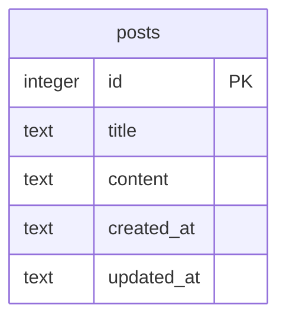

# 🏛️ 데이터 설계서 — QR Code 게시판 홈페이지

> *"And thou shalt make an ark of shittim wood ... And thou shalt put into the ark the testimony which I shall give thee."* — Exodus 25:10,16 (KJV)

---

## 1. 데이터 아키텍처 개요

| 항목 | 내용 |
|:---|:---|
| DBMS | SQLite 3 (better-sqlite3) |
| 스키마 전략 | 단일 DB 파일 (qrboard.db) |
| 테이블 네이밍 | snake_case, 복수형 |
| 컬럼 네이밍 | snake_case |

---

## 2. ERD



> 단일 테이블 구조 — req.md "게시판 1개"에 대응. 인증 없으므로 사용자 테이블 불필요.

---

## 3. 테이블 정의서

### TBL-001: posts (게시글)

> **목적:** 게시판의 게시글 데이터 저장 — 제목, 내용, 작성/수정 일시
> **연결 REQ:** REQ-002, FR-002, FR-003, FR-004, FR-005, FR-006

| # | 컬럼명 | 타입 | NULL | PK | FK | Default | 설명 |
|:--|:---|:---|:---:|:---:|:---|:---|:---|
| 1 | id | INTEGER | ❌ | ✅ | — | AUTOINCREMENT | 기본키 |
| 2 | title | TEXT | ❌ | — | — | — | 게시글 제목 |
| 3 | content | TEXT | ❌ | — | — | — | 게시글 내용 |
| 4 | created_at | TEXT | ❌ | — | — | (datetime('now','localtime')) | 작성일시 |
| 5 | updated_at | TEXT | ❌ | — | — | (datetime('now','localtime')) | 수정일시 |

**인덱스:**
| 인덱스명 | 컬럼 | 유형 | 사유 |
|:---|:---|:---|:---|
| idx_posts_created_at | created_at | BTREE | 최신순 목록 정렬 조회 |

**제약조건:**
- CHECK: `length(trim(title)) > 0` — 빈 제목 방어
- CHECK: `length(trim(content)) > 0` — 빈 내용 방어

---

## 4. DDL

```sql
CREATE TABLE IF NOT EXISTS posts (
    id         INTEGER PRIMARY KEY AUTOINCREMENT,
    title      TEXT    NOT NULL CHECK(length(trim(title)) > 0),
    content    TEXT    NOT NULL CHECK(length(trim(content)) > 0),
    created_at TEXT    NOT NULL DEFAULT (datetime('now','localtime')),
    updated_at TEXT    NOT NULL DEFAULT (datetime('now','localtime'))
);

CREATE INDEX IF NOT EXISTS idx_posts_created_at ON posts(created_at DESC);
```

---

## 5. 공통 코드 정의

> 현재 프로젝트는 단순 게시판으로 공통 코드(상태 코드, 에러 코드 등)가 불필요.
> 향후 확장 시 이 섹션에 추가.

| CODE-ID | 코드 그룹 | 코드 | 값 | 설명 |
|:---|:---|:---|:---|:---|
| — | — | — | — | 현재 없음 |

---

## 6. 인덱스 전략

| 주요 쿼리 패턴 | 인덱스 | 사유 |
|:---|:---|:---|
| 게시글 목록 (최신순) | idx_posts_created_at DESC | FR-002: 게시판 글 목록 조회 시 최신순 정렬 |

---

## 7. 데이터 무결성 규칙

| 규칙 | 적용 |
|:---|:---|
| NOT NULL | title, content, created_at, updated_at |
| CHECK (빈값 방어) | title: `length(trim(title)) > 0`, content: `length(trim(content)) > 0` |
| AUTOINCREMENT | id — 순차 증가 보장 |

### 방어 깊이 (Defense in Depth) 3중 구성

| 층 | 위치 | 방어 내용 |
|:---|:---|:---|
| 1 | 클라이언트 | HTML `required` 속성, Alpine.js 검증 |
| 2 | 서버 | Hono 핸들러에서 trim + 빈값 체크 |
| 3 | DB | CHECK 제약 — `length(trim(column)) > 0` |

---

## 8. 마이그레이션/시드 전략

| 항목 | 방법 |
|:---|:---|
| 초기화 | 서버 시작 시 `CREATE TABLE IF NOT EXISTS` 자동 실행 |
| 마이그레이션 | 별도 마이그레이션 도구 불필요 (단일 테이블) |
| 시드 데이터 | 선택적 — 개발 편의를 위해 샘플 게시글 3건 삽입 가능 |
