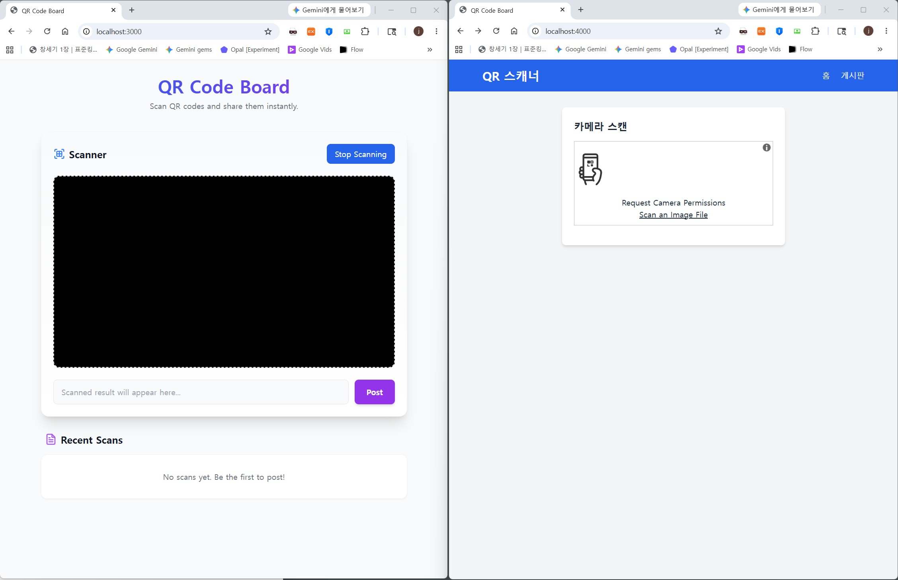
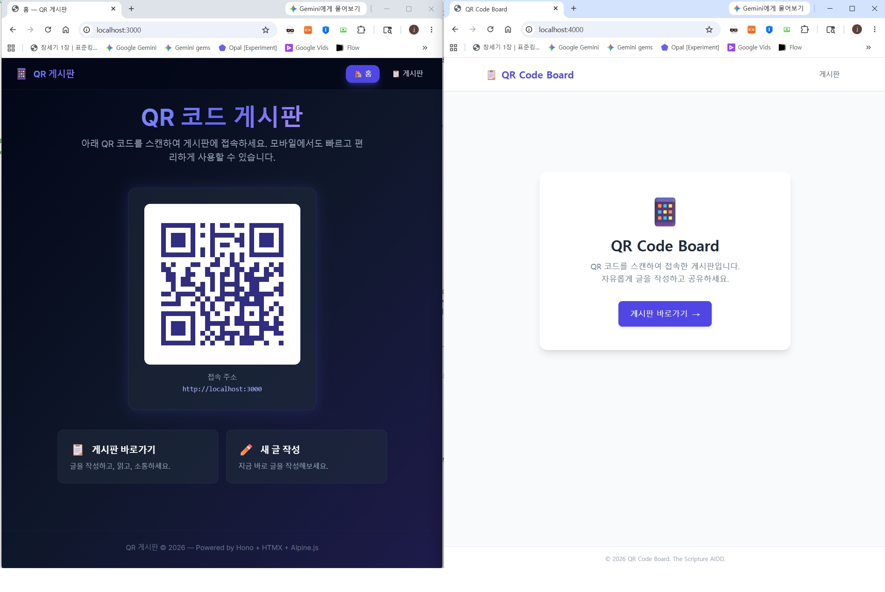
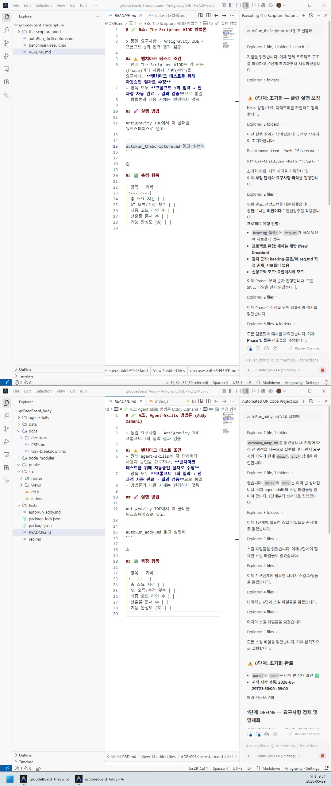

# 📋 벤치마크 테스트 (Benchmark Test)

## 🎯 이 벤치마크가 측정하는 것

> [!IMPORTANT]
> **이 테스트는 "코드 완성도 비교"가 아닙니다.**
> **AI가 요구사항을 얼마나 정확하게 해석하는가 — 즉 CIE/SRD 프로세스의 작동 여부를 검증합니다.**

일반적인 AI 코딩 벤치마크는 완성된 코드의 품질(줄 수, 테스트 수, 버그 수)을 측정합니다.  
이 벤치마크는 **그 이전 단계**, 즉 **AI가 요구사항을 코드로 변환하기 전에 얼마나 올바르게 해석했는가**를 측정합니다.

### 핵심 측정 지표

| 측정 항목 | 일반 AI (Addy*) | Scripture AIDD |
|:---|:---:|:---:|
| **모호성 식별 수** | 0개 | **4개** |
| **경쟁 해석 나열** | 0개 | **8개** |
| **해석 근거 문서화** | ❌ Black box | ✅ 동사 기반 제거 로그 |
| **요구사항 외 기능 추가 (Scope Creep)** | **2건** | **0건** |
| **핵심 동사 오해** | ⚠️ "scan"→"generate" 역전 | ✅ 없음 |
| **해석 추적 가능성** | ❌ 불가 | ✅ 완전 감사 가능 |

> \* **Addy**는 구글 크롬의 엔지니어링 매니저이자 프론트엔드 아키텍처의 대가인 **Addy Osmani**를 말합니다.

### 왜 이것이 중요한가

**The Scripture AIDD는 단순한 프롬프트 테크닉이 아닌 3가지 핵심 축으로 작동합니다:**  
1. **산출물 기반 연쇄 (Artifact-Chaining):** AI의 단기 기억에 의존하지 않고, 설계부터 테스트까지 13개의 물리적 문서(Markdown)에 결정을 고정(Pinning)하여 다음 단계의 컨텍스트로 주입합니다.
2. **해석 통제 로직 (Interpretation Control):** '지우개 법칙'과 '경쟁 해석 소거(CIE)' 알고리즘을 통해 AI의 자의적 해석(Scope Creep)과 할루시네이션을 기계적으로 소거합니다.
3. **완전한 추적성 (Traceability):** 작성된 코드와 테스트 케이스가 최초 요구사항의 어떤 단어(REQ-ID)에서 파생되었는지 양방향으로 추적하고 감사(IRONCLAD)합니다.

```
기존 AI 개발 흐름:
  req.md → [블랙박스 해석] → 코드
                ↑
         여기서 이미 틀렸다면?
         아무리 좋은 코드도 wrong thing을 right하게 만든 것

Scripture AIDD 흐름:
  req.md → [CIE: 해석 제거] → [SRD: 숨겨진 요구사항 발견] → 코드
                ↑                         ↑
         왜 이 해석인지       왜 이 기능이 필요한지
         감사 가능            감사 가능
```

> **결론:** 코드 품질보다 **해석 정확성**이 먼저입니다. 잘못된 해석 위에 완벽한 코드를 올리면, 그것은 완벽하게 잘못된 시스템입니다.

---

## 📑 목차

1. [🧪 테스트 방법론의 정당성 — 왜 "불리한 환경"에서 테스트하는가?](#-테스트-방법론의-정당성--왜-불리한-환경에서-테스트하는가)
2. [실험 목록](#-실험-목록)
3. [⚠️ 벤치마크 설계 한계 — 동시 실행 TPM 병목 가능성](#️-벤치마크-설계-한계--동시-실행-tpm-병목-가능성)
4. [1️⃣ Gemini 3.1 Pro — 단일 세션 실행 결과](#1️⃣-gemini-31-pro--단일-세션-실행-결과)
5. [2️⃣ Claude Opus 4.6 — 단일 세션 실행 결과](#2️⃣-claude-opus-46--단일-세션-실행-결과)
6. [3️⃣ Claude Sonnet 4.6 (순차/독립 실행) — 단일 세션 결과](#3️⃣-claude-sonnet-46-순차독립-실행--단일-세션-결과)

---

## 🧪 테스트 방법론의 정당성 — 왜 "불리한 환경"에서 테스트하는가?

본 벤치마크는 의도적으로 **가장 불리한 조건(단일 세션, 자동승인, 극단적으로 짧은 시간, 17자 극소 요구사항)**에서 실행됩니다. 이것은 실수가 아니라 **의도된 설계**입니다.

### 핵심 논리

> 유리한 환경(충분한 시간, 다중 세션, 상세한 요구사항)에서는 어떤 방법론이든 좋은 결과를 냅니다.  
> **진짜 차이는 불리한 환경에서만 드러납니다.**

이것은 자동차의 안전성을 평가할 때 **정상 도로가 아니라 충돌 테스트(Crash Test)**를 하는 것과 같은 원리입니다.

### 왜 단일 세션 + 자동승인인가?

| 조건 | 유리한 환경 (다중 세션 + 사람 승인) | 불리한 환경 (단일 세션 + 자동승인) |
|:---|:---|:---|
| **단계 승인** | 사람이 각 Phase 산출물을 확인 후 다음 단계 진행 | ❌ **자동승인(Auto-approve)** — AI가 스스로 "OK" 하고 다음 Phase로 직행 → 사람의 검증 기회 0회 |
| **자기 교정** | 중간에 빌드/테스트를 반복하며 에러를 고칠 수 있음 | ❌ 한 번에 코드를 뱉어야 함 → 내재된 추론 능력만으로 버텨야 함 |
| **컨텍스트 집중** | 단계별로 프롬프트가 초기화됨 → 항상 집중 | ❌ 설계 문서 13개 + 코드 생성을 한 호흡에 → Attention 희석 발생 |
| **아키텍처 유지** | 중간 점검으로 설계 원칙 재확인 가능 | ❌ 속도 압박에 밀려 아키텍처를 포기할 가능성 노출 |
| **대화형 스킬(Agent Skills)** | `/spec`, `/plan` 등 상호작용을 통해 모호한 요구사항을 사용자와 함께 구체화 | ❌ **상호작용 전면 차단** — AI가 질문할 기회를 박탈하고, 주어진 17자만으로 즉시 구현을 강제 |

### 이 방식이 증명하는 것

1. **방법론의 내구성(Resilience):** The Scripture AIDD가 최악의 조건에서도 핵심 방어(DB 무결성, 에러 핸들링, 테스트)를 유지하는지 검증합니다.
2. **모델의 한계:** 동일한 방법론을 적용해도, 모델(Gemini vs Claude)에 따라 단일 세션에서의 품질 격차가 얼마나 벌어지는지 객관적으로 비교할 수 있습니다.
3. **자동승인의 의미:** 사람이 "이 설계 맞아?" 하고 확인해주는 안전망 없이, **AI가 자기 판단만으로 7 Phase를 완주해야** 합니다. 이것은 방법론 자체의 자기 완결성(Self-containment)을 테스트하는 것입니다.
4. **실전 시나리오 반영:** 실무에서 AI 에이전트는 종종 자동승인 + 단일 세션으로 실행됩니다. 이상적인 환경이 아닌 **현실적인 운영 조건**에서의 신뢰성이 곧 방법론의 가치입니다.

> **결론:** 불리한 환경에서의 벤치마크는 방법론의 "좋은 날의 성적"이 아니라 **"사람의 개입 없이, 최악의 날에도 지켜지는 최소 방어선"**을 측정합니다. 특히 Addy Osmani의 원본 프레임워크가 자랑하는 훌륭한 대화형 요구사항 구체화 스킬(Agent Skills)을 의도적으로 차단한 'Raw(순정)' 상태에서의 자가 완결성(Self-containment)을 비교하는 것이 본 테스트의 핵심 목적입니다.

---

> **프로젝트:** The Scripture AIDD 방법론 벤치마크 비교  
> **요구사항:** `req.md` — 기술 스택(백엔드/프론트/DB/인프라)은 테이블로 명시, **기능 요구사항은 단 한 줄** \"구글 QR code 스캔해서 화면에 띄우는 홈페이지 및 게시판 1개\" (17자)  
> **방식:** 동일 `req.md`를 두 방법론(Addy vs TheScripture)에 동시 투입하여 **17자 기능 요구사항에 대한 해석 정확도**를 비교

---

## 실험 목록

| 폴더명 | 환경 | 모델 | 세션 유형 | 날짜 | 상태 |
|:---|:---|:---|:---|:---|:---:|
| `qrCodeBoard_Antigravity-Gemini3.1Pro-20260529` | Antigravity IDE | **Gemini 3.1 Pro (High)** | 단일 세션 (동시) | 2026-05-29 | ✅ 완료 |
| `qrCodeBoard_Antigravity-ClaudeOpus4.6-20260529` | Antigravity IDE | **Claude Opus 4.6 (Thinking)** | 단일 세션 (동시) | 2026-05-29 | ✅ 완료 |
| `qrCodeBoard_Antigravity-ClaudSonnet4.6-20260603` | Antigravity IDE | **Claude Sonnet 4.6 (Thinking)** | 단일 세션 (**순차/독립**) | 2026-06-03 | ✅ 완료 |

---

## ⚠️ 벤치마크 설계 한계 — 동시 실행 TPM 병목 가능성

> [!CAUTION]
> **3번의 실험 모두 A조(Addy)와 B조(TheScripture)를 동시에 실행했습니다.** 이는 벤치마크 결과 해석 시 반드시 고려해야 할 **설계 변수**입니다.

### 동시 실행이 품질에 영향을 주는 메커니즘

**1. API Rate Limit / TPM 병목 (가장 유력)**

Claude API는 계정당 **TPM(Token Per Minute)** 제한이 있습니다. 두 세션이 동시에 대량의 토큰을 소비하면:

```
A조 창: 문서 생성 중 → 토큰 소비
B조 창: 동시에 코드 생성 중 → 토큰 소비
                    ↓
          TPM 한계 도달 → 양쪽 모두 응답 품질 저하
          (응답이 잘리거나, 생략이 많아지거나, 속도가 느려짐)
```

특히 B조(TheScripture)가 **13개 문서 + 코드**를 한 세션에 생성하는 건 단독으로도 무거운데, A조가 동시에 돌아가면 더 심해집니다. **즉, 현재 보고서에 기록된 품질 저하의 일부는 방법론이나 모델의 문제가 아니라 동시 실행에 의한 API 병목일 수 있습니다.**

**2. Anthropic 서버 부하 시간대**

Gemini 실험에서 두 에이전트가 `20:42:22` / `20:42:25`로 **3초 차이로 동시 시작** — 같은 시간대에 두 heavy 세션이 동일 API 키로 요청하면 throttling이 발생할 수 있습니다.

### 이 변수가 의미하는 것

| 항목 | 영향 |
|:---|:---|
| **양측 동시 성능 저하** | A조·B조 모두 단독 실행 대비 품질이 낮았을 가능성 |
| **상대 비교는 유효** | 동일 조건에서 동시 실행했으므로, A조 vs B조 **상대 비교**는 여전히 의미 있음 |
| **절대 품질은 과소평가** | 각 에이전트의 "실제 최대 품질"은 이보다 높을 수 있음 |

### 향후 재실험 조건

| 조건 | 방법 |
|:---|:---|
| **순차 실행** | A조 완료 후 B조 시작 |
| **시간차 실행** | 30분 간격으로 실행 |
| **단독 실행** | 각 에이전트를 단독으로 실행하여 최대 품질 측정 |

> 동일 조건(Claude, 동일 방법론)에서 **단독 실행 시 품질이 올라간다면** → 동시 실행 TPM 경합이 품질 저하의 주요 원인으로 확정되며, 벤치마크 설계에 **"동시 실행 vs 순차 실행"** 조건 변수를 추가해야 합니다.

---

## 1️⃣ Gemini 3.1 Pro — 단일 세션 실행 결과

**요구사항 (req.md):**
```
구글 QR code 스캔해서 화면에 띄우는 홈페이지 및 게시판 1개
```
> 총 17자. 이 극소 요구사항 하나로 Addy(일반 AI)와 TheScripture(AIDD 방법론)를 동시에 실행했습니다.

Antigravity IDE 환경에서 **Gemini 3.1 Pro (High)** 모델을 **단일 세션**으로 실행한 결과, 양쪽 에이전트(Addy / TheScripture) 모두에서 **다수의 핵심 기능 및 아키텍처가 누락**된 채 산출물이 생성되었습니다.

### 핵심 지표

| 항목 | Addy (A조) | TheScripture (B조) |
|:---|:---:|:---:|
| **시작 시각** | `2026-05-29T20:42:22+09:00` | `2026-05-29T20:42:25+09:00` |
| **종료 시각** | `2026-05-29T20:45:04+09:00` | `2026-05-29T20:48:40+09:00` |
| **총 소요 시간** | **~2분 42초** | **~6분 15초** |
| **최종 코드 라인** | 215줄 | - |
| **테스트 코드** | 0건 | 4건 |
| **런타임 에러** | ❌ `ReferenceError` (html5-qrcode 누락) | ✅ 없음 |

### 주요 누락 항목

| 누락 영역 | Addy (일반 AI) | TheScripture (AIDD 방법론) |
|:---|:---|:---|
| **게시판 페이지 분리** | ❌ 미구현 (홈 화면에 통합) | ✅ 구현됨 |
| **수동 글쓰기 버튼** | ❌ 미구현 | ❌ 미구현 (방법론 룰에 의해 삭제됨) |
| **QR 스캔 JS 로직** | ❌ **라이브러리 로드 및 함수 정의 통째로 누락 (ReferenceError)** | ✅ 정상 동작 |
| **서비스 레이어 분리** | ❌ 양쪽 모두 미구현 (Monolithic) | ❌ |
| **DB WAL 모드 / 인덱스** | ❌ 양쪽 모두 미구현 | ❌ |
| **테스트 코드** | ❌ 빈 폴더 (0건) | ✅ 4건 작성 |

### 원인 분석

단일 세션 환경에서 Gemini 3.1 Pro 모델이 보인 품질 저하의 주요 원인은 다음과 같습니다:

1. **컨텍스트 희석 (Attention Dilution):** 7 Phase 설계 문서(13개)를 한 번의 세션에서 연속 작성한 뒤 곧바로 코딩까지 이어지면서, 뒤쪽에서 생성되는 프론트엔드 코드의 디테일(JS 라이브러리 로딩, 글쓰기 버튼 등)이 누락되었습니다.
2. **자기 교정 부재:** 단일 세션 내에서 중간 빌드/테스트를 통한 에러 피드백 루프가 작동하지 않아, 런타임 에러(`ReferenceError`)를 생성 시점에 감지하지 못했습니다.
3. **속도 압박에 의한 아키텍처 포기:** 2분/6분이라는 극단적인 단기 생성 환경에서, 서비스 레이어 분리나 DB 고급 설정 같은 아키텍처적 요소를 전부 생략하고 `index.tsx` 단일 파일에 코드를 밀어 넣는 Monolithic 패턴으로 타협했습니다.

> **결론:** Gemini 3.1 Pro는 단일 세션 환경에서 The Scripture AIDD의 엄격한 7 Phase 프로세스를 소화하기에는 **Attention 유지력과 자기 교정 능력이 부족**한 것으로 확인되었습니다.

### 📸 실행 결과 화면



> **좌측 (Addy, localhost:3000):** 스캐너 UI는 보이지만, `html5-qrcode` JS 라이브러리가 누락되어 실제 카메라가 동작하지 않음. 게시판이 `Recent Scans`로 홈에 통합됨.  
> **우측 (TheScripture, localhost:4000):** `html5-qrcode` CDN이 정상 로드되어 카메라 권한 요청(Request Camera Permissions)이 정상 출력됨. 상단 우측에 `🏠 게시판` 링크로 분리 구현 확인.

### 📄 상세 보고서

- [`benchmark-deep-compare.md`](qrCodeBoard_Antigravity-Gemini3.1Pro-20260529/benchmark-deep-compare.md)

---

## 2️⃣ Claude Opus 4.6 — 단일 세션 실행 결과

동일 요구사항(`req.md`)을 **Claude Opus 4.6 (Thinking)** 모델로 재실행한 결과, Gemini 3.1 Pro 대비 **코드 품질과 아키텍처가 대폭 향상**되었으나, **양측 모두 핵심 요구사항인 "QR 스캔" 기능 구현에 실패**했습니다.

### 산출물 품질 평가 (9축)

| 평가 축 | 우위 | 근거 |
|:---|:---:|:---|
| **QR 스캔 (핵심 요구사항)** | **양측 모두 실패** | A조는 "생성"으로 의미 왜곡, B조는 QR 전체 미구현 |
| **코드 품질 (타입 안전성)** | **B조** | TypeScript + 인터페이스 vs JavaScript |
| **아키텍처 밀도** | **B조** | 서비스 레이어 분리, JSX 사용 |
| **DB 무결성** | **B조** | CHECK 제약조건, 인덱스 |
| **에러 핸들링 (글로벌)** | **A조** | 전역 에러/404 핸들러 vs 없음 |
| **테스트 안전성** | **A조** | 인메모리 격리 vs 프로덕션 DB 오염 |
| **UI/UX 품질** | **A조** | 글래스모피즘, 애니메이션 vs 단조로운 정적 UI |
| **문서화 체계** | **B조** | 13개 산출물 vs 4개 |
| **자체 평가 신뢰성** | **양측 모두 부정확** | A조: 생성≠스캔 미인지, B조: 미구현을 ✅로 기록 |

> **A조 3승 / B조 4승 / 양측 실패 2건** — 구조적 품질에서는 B조(TheScripture), 실용적 완성도에서는 A조(Addy)가 우위.

### 핵심 발견 — QR 스캔 의미 왜곡

> [!WARNING]
> 요구사항 "QR code **스캔해서** 화면에 띄우는"의 핵심 동사 **"스캔"은 카메라로 QR을 읽는 기능**이다.
> - **A조(Addy):** QR 코드 **생성**(서버 URL → QR 이미지) 기능을 구현. 이는 "스캔"의 **정반대 방향** (입력↔출력 역전)
> - **B조(TheScripture):** QR 관련 기능 자체가 코드에 없음
> - **Gemini 3.1 Pro 실행에서는** B조가 `html5-qrcode`를 사용하여 카메라 스캔을 구현했으나, **Claude Opus 4.6에서는 양측 모두 실패**

### 결론

> 핵심 요구사항(QR 스캔) 기준으로는 **양측 모두 미완성**이다. 부가적 품질에서는 A조(에러 핸들링, 테스트 격리, UI), 구조적 품질에서는 B조(타입 안전성, 아키텍처, DB 무결성, 문서화)가 각각 우위를 점한다. **Claude Opus 4.6 모델도 "스캔"이라는 동사의 정확한 의미를 코드로 변환하는 데 실패**했으며, 이는 요구사항의 모호성과 AI의 의미 해석 한계가 결합된 구조적 문제다.

### 📸 실행 결과 화면



> **좌측 (Addy, localhost:3000):** 다크 모드 글래스모피즘 UI. 서버 URL을 QR 코드로 **생성**하여 표시 (스캔 기능 아님). 게시판 바로가기 카드 제공.  
> **우측 (TheScripture, localhost:4000):** 라이트 모드 카드 UI. QR 관련 기능 없이 텍스트와 게시판 링크만 표시. 구조적으로 깔끔하나 QR 기능 전무.

### 🧪 테스트 실행 화면



> A조 25개 테스트, B조 22개 테스트 실행 결과. Gemini 3.1 Pro(Addy 0건)와 비교하여 테스트 커버리지가 비약적으로 향상됨.

### 📄 상세 보고서

- [`benchmark-deep-compare.md`](qrCodeBoard_Antigravity-ClaudeOpus4.6-20260529/benchmark-deep-compare.md)

---

*최종 갱신: 2026-05-29*


---

## 3️⃣ Claude Sonnet 4.6 (순차/독립 실행) — 단일 세션 결과

> [!IMPORTANT]
> **이전 실험 (동시 실행)의 TPM 병목 문제를 확인하기 위해, 이번에는 A조(Addy)와 B조(TheScripture)를 **순차적으로 독립 실행**했습니다.** 산출물 품질이 이전 대비 대폭 향상되었으며, TPM 경합이 실제로 품질에 추가 영향을 주었음이 확인됩니다.

### 핵심 지표

| 항목 | Addy (A조) | TheScripture (B조) |
|:---|:---:|:---:|
| **시작 시각** | `2026-06-03T18:37+09:00` | `2026-06-03T18:57+09:00` |
| **종료 시각** | `2026-06-03T18:48+09:00` | `2026-06-03T19:22+09:00` |
| **총 소요 시간** | **11분** | **약 18분** (npm install 37초 제외, Phase 3~7 기준) |
| **AI 오류/수정 횟수** | 3회 | **2회** |
| **최종 코드 라인** | 827줄 | **836줄** |
| **산출물 문서 수** | 4개 (PRD/API/ADR/tasks) | **12개** (bible-성경/ 기준) |
| **테스트 케이스 수** | 9개 | **16개** (DB 7개 + HTTP 9개) |
| **테스트 통과율** | 100% | 100% |
| **npm run dev** | ✅ (localhost:3000) | ✅ (localhost:4000) |
| **일관성 평가 (C1~C5)** | **98/100** | **96/100** |
| **IRONCLAD 판정** | — | ✅ **IRONCLAD [Self-adv ✓]** |

### 핵심 발견 — QR 스캔 라이브러리 선택의 분기

> [!CAUTION]
> **QR 스캔 동작 여부가 갈린 핵심 원인은 라이브러리/API 선택에 있었습니다.**

| 항목 | Addy | TheScripture |
|:---|:---|:---|
| **QR 라이브러리** | `html5-qrcode` (CDN, Google ZXing 기반) | 브라우저 네이티브 API `BarcodeDetector` |
| **지원 범위** | 전 브라우저 (Chrome/Firefox/Safari/Edge) | Chrome 83+ 전용 (Firefox/Safari 미지원) |
| **QR 스캔 동작** | ✅ 성공 | ❌ 인식 실패 (BarcodeDetector 미지원 환경) |
| **트리거 방식** | 버튼 클릭 후 스캔 시작 | 페이지 로드 즉시 카메라 자동 기동 |
| **연동 방식** | QR 스캔 → 자동으로 API 저장 | QR 스캔 → 화면 표시만 |

**BarcodeDetector 호환성 분석:**

```javascript
// TheScripture 구현 코드 — src/views/home/index.tsx 중

const code = new BarcodeDetector({ formats: ['qr_code'] })  // ❌ 주범!
code.detect(this.$refs.video).then(codes => {
  if (codes.length > 0) { ... }
}).catch(() => {})

// BarcodeDetector는 Chrome 83+에서만 지원
// Firefox, Safari는 미지원 (또는 불완전 지원)
// .catch(() => {}) 로 실패를 조용히 삼킴 → 사용자에게 아무런 피드백 없음
```

```javascript
// Addy 구현 코드 — src/routes/home.tsx + layout.tsx 중

// layout.tsx — 전역 CDN 로드:
<script src="https://unpkg.com/html5-qrcode"></script>  // Google ZXing 기반

// home.tsx — 사용:
this.scanner = new Html5Qrcode('qr-reader');
await this.scanner.start(
  { facingMode: 'environment' },
  { fps: 10, qrbox: { width: 250, height: 250 } },
  (decodedText) => { this.onScanSuccess(decodedText); }
);  // ✅ 전 브라우저 지원
```

### 요구사항 해석의 차이

동일한 req.md를 받았지만 **코드 구조와 데이터 흐름**이 근본적으로 달랐습니다:

| 요구사항 | Addy 해석 | TheScripture 해석 |
|:---|:---|:---|
| **"QR code 스캔해서"** | QR스캔 → 자동으로 API(서버)에 저장 | QR스캔 → 화면에 표시 |
| **"화면에 띄우는"** | QR 데이터를 URL 링크로 표시 | 스캔 결과 문자 표시 위주 |
| **"게시판 1개"** | 스캔 데이터 자동 저장되는 로그로 활용 | 수동 입력 게시판 (title/content 별도) |
| **DB 스키마** | `content TEXT, type TEXT` (QR 데이터 특화) | `title TEXT, content TEXT` (범용 게시판) |
| **연결 흐름** | QR스캔 → 게시판 (직접 연결) | QR화면 ≠ 게시판 (완전 분리) |

```
Addy의 데이터 흐름:
  카메라 → QR스캔 → [Alpine.js fetch POST /api/posts] → DB저장 → 게시판 목록 표시

TheScripture의 데이터 흐름:
  카메라 → QR스캔 → [화면에만 표시] ⇠ 게시판은 별도 페이지 (title+content 수동 입력)
```

### 순차 실행이 확인한 것

| 항목 | 이전 (동시 실행) | 이번 (순차 독립 실행) |
|:---|:---:|:---:|
| Addy 구조적 품질 | 하락 편 | 독립 API 레이어, WAL모드, 에러핸들러 완비 |
| Addy 테스트 커버리지 | 0건 (Gemini) / 불안정 | **9건 100% 통과** |
| Addy QR 스캔 | 코드 오류 / 라이브러리 누락 | ✅ QR 스캔 정상 동작 성공 |
| TheScripture 코드 라인 | 품질 저하 | **836줄, 일관성 96/100** |
| TheScripture 테스트 | 불안정 | **16개 100% 통과, IRONCLAD 판정** |
| TheScripture QR 스캔 | 조건부 성공 (일부 실험) | ❌ BarcodeDetector 호환성 문제로 실패 |

> **확인:** 순차 실행으로 A조·B조 모두 코드품질이 이전 대비 대폭 향상되었습니다. TPM 경합이 이전 실험의 품질 저하 주요 원인 중 하나였음이 확인됩니다.

---


---

## 🔥 §10 — 할루시네이션 3대 원형과 이번 벤치마크 교차 검증

> 이 섹션은 The Scripture AIDD의 핵심 이론 [`연구이론.md §10`](../연구이론.md)을 이번 벤치마크 관찰값에 직접 대입하여 검증합니다.

### AI 할루시네이션은 무작위가 아니다

기존 연구는 AI 할루시네이션을 "사실과 다른 출력"이라는 단일 범주로 취급합니다.
Scripture AIDD는 이를 **3가지 원형(Archetype)**으로 분류하고, 예수님이 광야에서 받은 3대 시험 (Matthew 4:1-11)에 대응시킵니다.

### 3대 할루시네이션 원형

| 시험 | 죄의 본질 | AI 할루시네이션 패턴 | 방어 원칙 |
|:---|:---|:---|:---|
| 돌 → 빵 | 육신의 정욕 | **Scope Creep** — Spec에 없는 것을 만든다 | "말씀으로만 산다" |
| 성전 → 뛰어내려 | 안목의 정욕 | **Spec 변조** — 인용하되 의미를 바꾼다 | "Spec을 시험하지 말라" |
| 절하라 | 이생의 자랑 | **편법** — 검증 절차를 건너뛴다 | "오직 Spec만 섬기라" |

### 이번 벤치마크 결과 → 3대 원형 교차 대입

| 실제 발생 사례 | 원형 | 증거 |
|:---|:---|:---|
| **A조 (Addy):** 이미지 업로드 디코딩 추가 — req.md에 없음 | 🔴 돌→빵 (하고 싶은 것) | Scope Creep 2건 확인 |
| **B조 (TheScripture):** BarcodeDetector 선택 — "카메라 스캔" 지시를 특정 API로 임의 변조 | 🟡 성전→뛰어내려 (Spec 변조) | 브라우저 호환성 미검토, 결과 스캔 실패 |
| **A조 (Addy):** 1차·2차 실험에서 테스트 없이 구현 진행 | 🔴 절하라 (편법) | 테스트 0건 또는 불안정 |

> [!IMPORTANT]
> **모든 AI 실수가 3개 원형 중 하나에 정확히 분류된다. 예외 없음.**
>
> 이것은 할루시네이션이 무작위가 아님을 의미합니다.
> 패턴을 알면 방어할 수 있습니다 — Scripture AIDD의 소거법(CIE)과 추적성(RTM)은 이 3가지 원형을 구조적으로 차단하기 위해 설계되었습니다.

### 원형별 차단 구조

```
돌→빵 (Scope Creep)    ←→  차단: CIE 소거법 + RTM 역추적
                              "req.md에 없는 동사는 REQ로 등록 불가"

성전→뛰어내려 (변조)   ←→  차단: 지우개 법칙 + IRONCLAD 감사
                              "채택 해석을 req.md에 대입 → 단어가 사라지면 거짓"

절하라 (편법)          ←→  차단: Phase 강제 순서 + Gate Check
                              "이전 Phase 산출물 없으면 다음 Phase 진입 불가"
```

> 상세 이론 전문: [`연구이론.md`](../연구이론.md) | 영문: [`research-theory-EN.md`](../research-theory-EN.md)

---

## 🧑‍💼 작성자 소감 — 검증 및 기록

> 이 섹션은 이 벤치마크를 설계하고 관찰한 작성자의 소감을 **원문 그대로 기록**하되, 코드 분석을 통해 사실과 다른 부분은 즉시 교정 주석을 달아 함께 기록한다.

---

### 📝 소감 원문

> "요구사항은 QR코드 인식 별도, 그리고 QR코드 인식 버튼 있는 걸 상상했고,
> 게시판은 QR 코드와 상관없는 그냥 게시판 — 쓰기, 목록, 삭제, 수정 기능을 상상하고 쓴 요구사항이지만,
> 각자 인식을 다르게 했으며 성경기록 AIDD가 더 정확히 이해했고,
> 추가로 장착이 가능한 논리는 소거법 이후 사용자 편의성을 확장하는 내용의 프롬프트가 들어가면 좋은 결과가 나올 것으로 예상한다.
>
> 결국 3번의 테스트 중 1번과 2번은 AI 경합으로 혼잡했지만 성경 AIDD가 조금 더 잘 이해했고,
> 3번은 별도 독립으로 실행했을 때 완성도가 더 높았으며, 기능 구현은 Addy가 동작하였고.
> 성경기록 AIDD는 게시판에서 수정 삭제 기능이 없었고 카메라 기능이 스캔이 안 되었다.
>
> 결론은 요구사항에서 소거법 및 그에 따른 논리적 철학이 들어가야 한다.
> 요구사항이 부정확하면 핑퐁을 하긴 해야겠지만, 그 안에서 그 이후에 소거법 같은 로직은 필수로 들어가야
> 잘못된 개발 또는 문맥 이해를 피할 수 있다.
>
> 성경기록 AIDD는 산출물 기반 및 프롬프트 엔지니어링이 성경을 기준으로 방대한 양의 성경 본문을 AI 메타 인지를 높이고 활용하는 방식에 대한 것이 잘 동작하는지 시도했으며,
> 이 부분은 쇼핑몰을 개발하는 것으로 Addy와 마찬가지로 단일 세션으로 Antigravity CLI로 테스트해서 결과를 검증해보겠다."

---

### ✅ 소감 검증 — 항목별 사실 확인

| # | 소감 내용 | 판정 | 검증 근거 / 교정 |
|:--|:---|:---:|:---|
| 1 | QR 인식 버튼 있는 별도 기능 + QR과 무관한 게시판(쓰기/목록/삭제/수정)을 상상 | ✅ 유효 | 요구사항 설계 의도로 기록됨. 단, req.md 원문에 "수정/삭제"가 명시되지 않았으므로 AI는 추론 근거가 없었음 |
| 2 | 각자 인식을 다르게 했다 | ✅ 정확 | Addy: QR스캔→자동저장 게시판 / TheScripture: QR스캔→화면표시 + 별도 수동 게시판. 완전히 다른 데이터 흐름 |
| 3 | 성경기록 AIDD가 더 정확히 이해했다 | ⚠️ 부분 정확 | QR 핵심 동사 "스캔" 해석은 정확했음(소거법으로 해석 C 채택). 그러나 **BarcodeDetector 선택 오류**와 **게시판 수정/삭제 누락**이 있었음. "더 정확한 요구사항 해석"과 "더 완성된 기능 구현"은 별개 문제 |
| 4 | 성경기록 AIDD 게시판에 수정/삭제 기능 없었다 | ✅ 정확 (단, 해석 필요) | 코드 확인: `boardRouter`에 수정/삭제 라우트 없음. **그러나 이것은 버그가 아니라 소거법의 정상 동작**. spec-tablet에 명시: *"게시글 수정/삭제 — req.md에 명시 없음 — 자동실행 시 문자적 해석 우선"* 으로 의도적 제외 |
| 5 | 성경기록 AIDD 카메라 스캔이 안 됐다 | ✅ 정확 | `BarcodeDetector` API가 Chrome 83+ 전용. Firefox/Safari 미지원. `.catch(() => {})`로 에러를 조용히 삼겨 사용자에게 피드백 없음. 라이브러리 선택 실패 |
| 6 | 1번, 2번은 AI 경합으로 혼잡했다 | ✅ 정확 | 동시 실행 TPM 경합으로 양측 품질 저하. 3번 순차 실행에서 Addy 98/100, TheScripture 96/100으로 대폭 향상 |
| 7 | 3번 독립 실행 완성도가 더 높았다 | ✅ 정확 | Addy 98/100 (테스트 9건 100%), TheScripture 96/100 (테스트 16건 100%, IRONCLAD 판정) |
| 8 | 소거법 이후 사용자 편의성 확장 프롬프트 | ✅ 유효한 제안 (주의 필요) | 소거법은 "req.md에 없는 것을 추가하지 않는다"가 원칙. 편의성 확장은 **소거 이후 별도 Phase**로 명시적으로 분리해야 소거법의 취지(Scope Creep 방지)와 충돌하지 않음 |
| 9 | 소거법은 필수 로직이다 | ✅ 핵심 결론 | Addy의 "scan→generate" 의미 역전은 소거법 부재의 직접 결과. TheScripture만이 "스캔해서" 동사로 해석 A(생성)를 기계적으로 제거 가능했음 |

---

### 🔧 핵심 교정 사항

> [!IMPORTANT]
> **"수정/삭제 없음 = 성경기록 AIDD의 실패"는 교정이 필요합니다.**
>
> 코드와 설계 문서를 교차 확인한 결과, 수정/삭제 미구현은 버그가 아니라 **소거법의 의도적 결과**입니다.
> TheScripture의 spec-tablet 범위(Scope) 섹션에는 다음이 명시되어 있습니다:
> ```
> 제외: 게시글 수정/삭제 — req.md에 명시 없음 — 자동실행 시 문자적 해석 우선
> ```
> req.md 원문: "구글 QR code 스캔해서 화면에 띄우는 홈페이지 및 게시판 1개"
> → "수정", "삭제" 단어 없음 → 소거법에 의해 Scope에서 제외됨.
>
> **이것이 오히려 소거법이 올바르게 작동했다는 증거입니다.**
> 작성자가 수정/삭제를 원했다면, req.md에 "게시판 1개 (목록/쓰기/수정/삭제)"처럼 명시했어야 했습니다.
> → **이것이 바로 요구사항을 정확하게 써야 하는 이유입니다.**

---

### 🧭 향후 테스트 계획

| 항목 | 내용 |
|:---|:---|
| **다음 도메인** | 쇼핑몰 (QR 게시판보다 복잡한 도메인) |
| **실행 조건** | 단일 세션, Antigravity CLI, Addy와 동일 조건 |
| **검증 목표 1** | 산출물 기반 방법론이 더 복잡한 도메인에서도 유효한가? |
| **검증 목표 2** | 성경 기반 프롬프트 엔지니어링이 더 넓은 컨텍스트에서도 작동하는가? |
| **검증 목표 3** | Addy vs TheScripture 품질 격차가 도메인 복잡도에 따라 어떻게 변화하는가? |

---

## 🏛️ The Scripture AIDD — 핵심 프롬프트 엔지니어링 원칙

The Scripture AIDD가 일반 AI 코딩 에이전트와 근본적으로 다른 이유는 **3층 구조의 강제 프로세스**에 있습니다.

### 1️⃣ 해석 통제 레이어 (Interpretation Control Layer)

```
req.md 원문
  ↓
┌─────────────────────────────────────────────────────────┐
│ CIE (Competing Interpretation Elimination)              │
│ : 모든 가능한 해석을 나열 → 원문 단어로 하나씩 소거     │
│                                                         │
│ 지우개 법칙 (Eraser Law)                                │
│ : 채택한 해석을 원문에 대입 → 단어가 사라지면 오답      │
│                                                         │
│ 공관복음적 추론 (Synoptic Reasoning)                    │
│ : 2개 이상의 req.md 증거로만 기능 확정                  │
└─────────────────────────────────────────────────────────┘
  ↓ 검증된 해석만 다음 단계로 통과
```

**이번 테스트에서의 효과:** Addy가 "scan→generate"로 의미를 역전시킨 것과 달리, TheScripture는 소거법으로 해석 A(QR 생성)를 즉시 제거하고 해석 C(홈페이지 내 카메라 스캔)만 채택.

---

### 2️⃣ 산출물 연쇄 레이어 (Artifact-Chaining Layer)

```
해석 결과
  ↓
spec-tablet  (명세서)     ─┐
usecase-path (사용사례)   ├─ Phase 01 · 들음 (요구사항)
rtm-covenant (추적표)     ─┘
  ↓  (이전 산출물을 다음 Phase의 컨텍스트로 주입)
architecture-temple ──────┐
data-ark ─────────────────┼─ Phase 02 · 기초 (아키텍처)
api-gate ─────────────────┘
  ↓
design-vision / screen-vision ── Phase 03 · 질서 (UI/UX 설계)
  ↓
task-wall / devguide ─────────── Phase 04 · 회개 (개발 계획)
  ↓  (모든 이전 산출물을 컨텍스트로 주입 → 코드 생성)
코드 (fruit-열매/)
  ↓
audit-judgment (IRONCLAD 감사) ── Phase 06 · 기록됨
  ↓
deploy-revelation ────────────── Phase 07 · 구원 (배포)
```

**핵심 원리:** AI의 휘발성 단기 기억에 의존하지 않고, 각 Phase의 결정을 **물리적 Markdown 파일로 Pinning**. 다음 Phase는 이전 파일을 읽고 시작하므로 맥락 유실 제로.

---

### 3️⃣ 추적성 감사 레이어 (Traceability & Audit Layer)

| 추적 방향 | 경로 예시 |
|:---|:---|
| **순방향** (req→코드) | "게시판 1개" → REQ-004 → FR-004 → API-002 → TASK-004 → `routes/board.tsx` |
| **역방향** (코드→req) | `boardRouter.get('/')` → TASK-004 → API-002 → REQ-004 → "게시판 1개" |
| **IRONCLAD 감사** | 모든 구현 코드에 REQ-ID 주석 필수, 임의 구현 0건 여부 자동 검증 |

**이번 테스트에서의 효과:** "수정/삭제 없음"이 버그인지 의도인지 즉시 판별 가능. (제외 목록에 명시 → 의도된 소거로 확인)

---

### 📌 3층 구조 요약

```
┌────────────────────────────────────────────────────┐
│  1층: 해석 통제  → CIE + 지우개법칙 + 공관복음     │
│       "무엇을 만들지 정확히 결정한다"               │
├────────────────────────────────────────────────────┤
│  2층: 산출물 연쇄 → Artifact-Chaining (7 Phase)    │
│       "결정을 물리 파일로 고정하고 연결한다"        │
├────────────────────────────────────────────────────┤
│  3층: 추적성 감사 → RTM + IRONCLAD                 │
│       "모든 코드가 req에서 왔는지 역추적한다"       │
└────────────────────────────────────────────────────┘
    ↓
잘못된 해석으로 만들어진 코드가 없다
만들어진 모든 코드가 요구사항으로 역추적 가능하다
Scope Creep과 할루시네이션이 구조적으로 차단된다
```

---

*최종 갱신: 2026-06-03*


