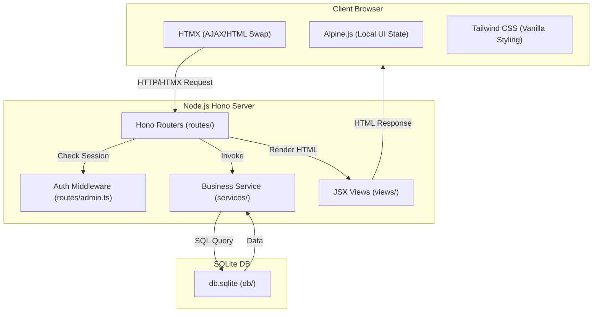
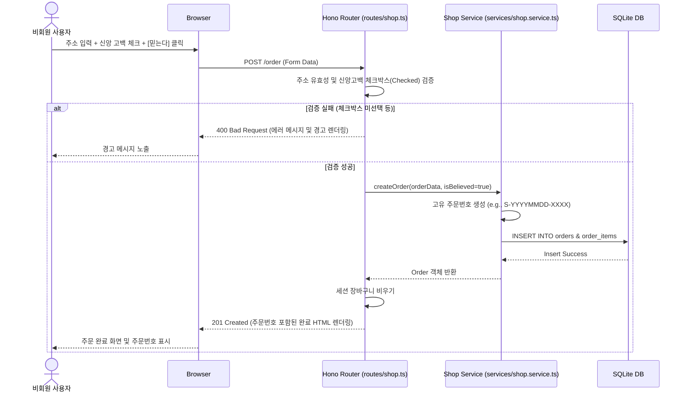

# 🏗️ 시스템 설계서 — The Scripture Shop (성경 쇼핑몰)

> **정경(Bible):** 이 문서는 The Scripture Shop 프로젝트의 시스템 설계서이다.
> 이 문서의 권위는 절대적이며, 후속 개발은 본 성전 설계를 엄격하게 따라야 한다.

---

## 1. 시스템 개요

| 항목 | 내용 |
|:---|:---|
| 시스템명 | The Scripture Shop (성경 쇼핑몰) |
| 버전 | v1.0 |
| 아키텍트 | Antigravity (개발 에이전트) |
| 상태 | **Canonized(정경화)** |

---

## 2. 아키텍처 다이어그램

---

## 3. 기술 스택

| 계층 | 기술 스택 | 선택 근거 | 관련 REQ-ID |
|:---|:---|:---|:---|
| **런타임** | Node.js (v20+) | Hono 및 SQLite 생태계 활용의 용이함 | C-001 |
| **백엔드 프레임워크**| Hono | 경량성, JSX 지원 및 뛰어난 라우팅 성능 | C-001 |
| **프론트엔드/상호작용**| HTMX + Alpine.js | 무거운 Single Page App (SPA) 대신 가벼운 HTML 기반 비동기 교환(HTMX) 및 심플 로컬 상태(Alpine) 지원 | C-002 |
| **프론트엔드 스타일**| Tailwind CSS | 유틸리티 퍼스트 CSS를 통한 미적 완성도와 신속한 스타일 구성 | C-002 |
| **데이터베이스** | SQLite | 로컬 설치 및 구동이 가능하고 단일 파일로 완전한 데이터 무결성 보장 | C-003 |
| **인프라/클라우드** | 로컬 PC 구동 | 요구사항 명세에 정의된 로컬 실행 환경 충족 | C-004 |

---

## 4. 폴더 구조 판단

### 판단 체크리스트

| # | 질문 | 답변 | 결과 |
|:--|:---|:---|:---|
| 1 | CRUD가 포함되어 있는가? | ✅ YES | 분리 강제 (HTTP 처리와 렌더링 분리) |
| 2 | 화면 수는 몇 개인가? | 4개 (메인/카탈로그, 장바구니, 주문/신앙고백, 어드민 대시보드) | 분리 대상 |
| 3 | 한 파일에 HTTP 처리 + 렌더링이 섞이는가? | ❌ NO (경고 트리거 방지 및 단일 책임 분리) | routes/와 views/ 분리 필수 |

### 판단 결과
- **채택 구조:** HTTP 핸들러(`routes/`)와 JSX 렌더링(`views/`)을 완전히 분리
- **판단 근거:** CRUD 관리자 화면 및 사용자 주문서 화면 등 여러 기능과 동적 상태가 섞여있으므로 유지보수성과 단일 책임 원칙(SRP)을 지키기 위해 파일 분리.
- **예상 최대 파일 줄 수:** ~250줄 이하로 설계 (각 파일의 책임을 세분화하여 300줄 한도 보호)
- **파일 목록 및 폴더 구조:**
  - `fruit-열매/db/`: SQLite 연결 및 Seed 데이터 주입 (`db/client.ts`, `db/seed.ts`)
  - `fruit-열매/services/`: 비즈니스 로직 및 DB 쿼리 (`services/shop.service.ts`, `services/admin.service.ts`)
  - `fruit-열매/views/`: JSX 기반 HTML 템플릿 컴포넌트 (`views/layout.tsx`, `views/shop.tsx`, `views/admin.tsx`)
  - `fruit-열매/routes/`: Hono HTTP 라우터 핸들러 (`routes/shop.ts`, `routes/admin.ts`)
  - `fruit-열매/index.ts`: 메인 애플리케이션 진입점 및 세션 미들웨어 설정

---

## 5. 아키텍처 결정 체인

| 결정 사항 | 근거 REQ-ID | 왜 이 선택인가 | 이 결정이 만드는 제약 | Phase 3/4 영향 |
|:--|:--|:--|:--|:--|
| Hono JSX & HTMX | REQ-001, REQ-002, REQ-003 | 클라이언트 렌더링 복잡도를 낮추고 서버 사이드에서 HTML 카드를 갱신하여 신속한 피드백 제공 | JSON API 대신 HTML fragment를 반환하는 엔드포인트 설계 필수 | routes/가 HTML 문자열(JSX)을 반환 |
| SQLite 데이터베이스 | REQ-001, REQ-005 | 로컬 PC 환경에서 영속 데이터 관리에 가장 가볍고 효율적임 | 동시성 제약 및 SQLite 단일 커넥션 설정 필요 | `better-sqlite3` 또는 `sqlite3` 드라이버 사용 및 client 인스턴스 싱글톤 관리 |
| admin 세션 쿠키 인증 | REQ-005 | 관리자 로그인 `admin/admin` 정보를 세션 쿠키 또는 서명된 쿠키에 저장하여 간결한 인증 구현 | admin 라우터 접근 시 쿠키 존재 여부 및 값 검증 미들웨어 필수 적용 | `hono/cookie` 또는 `hono/session` 활용 |

---

## 6. 시퀀스 다이어그램 (신앙 고백 및 주문 완료 흐름)

---

## 7. 보안 아키텍처 (봉인의 율법)

1. **관리자 인증 제어 (봉인의 율법 제7계명 - 접근 제어):**
   - `/admin` 하위의 모든 페이지와 API 요청은 인증 미들웨어(Auth Middleware)를 거쳐야 한다.
   - 인증에 실패하거나 세션이 만료된 경우 즉시 관리자 로그인 페이지(`/admin/login`)로 강제 리다이렉트된다.
2. **SQL Injection 방어 (봉인의 율법 제3계명 - 무결성):**
   - SQLite 쿼리 작성 시 오직 Prepared Statement 파라미터화 바인딩(`?` 또는 `:param`)만 사용한다. 날 것의 사용자 입력을 쿼리 문자열에 합치는 문자열 접합(Concatenation)은 전면 금지한다.
3. **송장번호 입력 유효성 검증 (봉인의 율법 제2계명 - 입력 검수):**
   - 서버 레벨에서 `/admin/orders/:id/ship` 요청 수신 시, 송장번호 파라미터가 `^\d{8}$` 정규식과 완전히 부합하는지 2차 검증하여 잘못된 데이터를 원천 차단한다.
