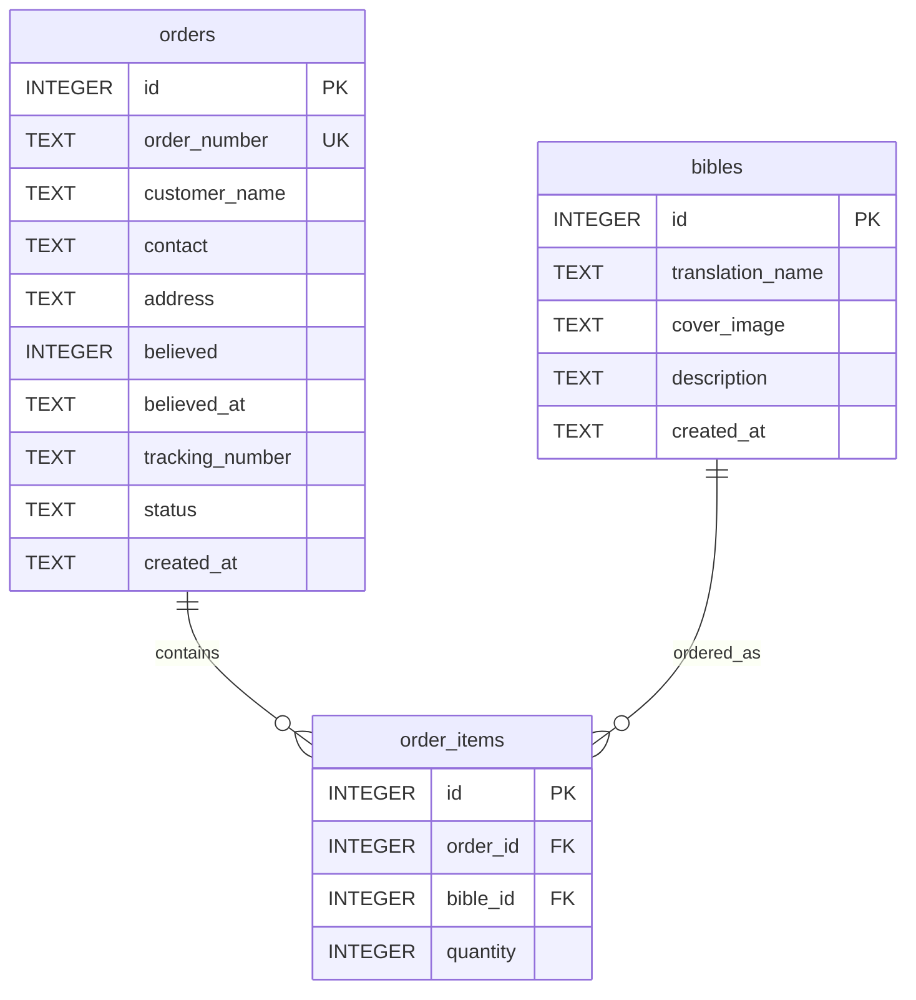

# 🏛️ 데이터 설계서 — The Scripture Shop (성경 쇼핑몰)

> **정경(Bible):** 이 문서는 The Scripture Shop 프로젝트의 데이터 아키텍처 및 DDL 설계서이다.
> 법궤의 규격에 따라 데이터베이스 스키마와 무결성 제약을 엄격히 설계하여 영속성 계층의 정결함을 지킨다.

---

## 1. 데이터 아키텍처 개요

| 항목 | 내용 |
|:---|:---|
| DBMS 종류 | SQLite |
| 스키마 전략 | 단일 로컬 파일 데이터베이스 (`db.sqlite`) |
| 네이밍 규칙 | 테이블명: snake_case (복수형), 컬럼명: snake_case, 기본키: id |

---

## 2. ERD (엔티티 관계도)

---

## 3. 테이블 정의서

### TBL-001: bibles (성경 목록 테이블)

> **목적:** 쇼핑몰에 공급될 무료 성경 목록을 저장하는 마스터 테이블 (Seed 데이터 10개 전용)
> **연결 REQ:** REQ-001

| # | 컬럼명 | 타입 | NULL | PK | FK | Default | 설명 |
|:--|:---|:---|:---:|:---:|:---|:---|:---|
| 1 | id | INTEGER | ❌ | ✅ | — | AUTOINCREMENT | 기본키 |
| 2 | translation_name | TEXT | ❌ | — | — | — | 성경 번역본 이름 |
| 3 | cover_image | TEXT | ❌ | — | — | — | 성경 표지 이미지 경로/URL |
| 4 | description | TEXT | ❌ | — | — | — | 상세 설명 문구 |
| 5 | created_at | TEXT | ❌ | — | — | CURRENT_TIMESTAMP | 레코드 생성 일시 |

**인덱스:**
| 인덱스명 | 컬럼 | 유형 | 사유 |
|:---|:---|:---|:---|
| idx_bibles_translation | translation_name | UNIQUE | 번역본 이름으로 조회 시 신속 검색 |

**제약조건:**
- UNIQUE: `translation_name`
- CHECK: 
  - `CHECK(length(trim(translation_name)) > 0)`
  - `CHECK(length(trim(cover_image)) > 0)`

---

### TBL-002: orders (주문 정보 테이블)

> **목적:** 비회원이 신앙 고백을 완료하고 입력한 배송 주소 정보와 고유 주문번호를 저장하는 테이블
> **연결 REQ:** REQ-003, REQ-004, REQ-005

| # | 컬럼명 | 타입 | NULL | PK | FK | Default | 설명 |
|:--|:---|:---|:---:|:---:|:---|:---|:---|
| 1 | id | INTEGER | ❌ | ✅ | — | AUTOINCREMENT | 기본키 |
| 2 | order_number | TEXT | ❌ | — | — | — | 고유 주문번호 (S-YYYYMMDD-XXXX) |
| 3 | customer_name | TEXT | ❌ | — | — | — | 비회원 수령인 이름 |
| 4 | contact | TEXT | ❌ | — | — | — | 연락처 |
| 5 | address | TEXT | ❌ | — | — | — | 배송지 주소 |
| 6 | believed | INTEGER | ❌ | — | — | — | 신앙 고백 동의 여부 (0: 미동의, 1: 동의) |
| 7 | believed_at | TEXT | ❌ | — | — | — | 신앙 고백 동의 일시 (ISO-8601) |
| 8 | tracking_number | TEXT | ⚠️ | — | — | NULL | 송장번호 (8자리 숫자) |
| 9 | status | TEXT | ❌ | — | — | 'PENDING' | 주문 상태 ('PENDING', 'SHIPPED') |
| 10 | created_at | TEXT | ❌ | — | — | CURRENT_TIMESTAMP | 주문 일시 |

**인덱스:**
| 인덱스명 | 컬럼 | 유형 | 사유 |
|:---|:---|:---|:---|
| idx_orders_number | order_number | UNIQUE | 비회원 배송조회 시 주문번호 빠른 색인 |
| idx_orders_status | status | Normal | 관리자 페이지에서 배송 대기 / 완료 건 필터링 성능 향상 |

**제약조건:**
- UNIQUE: `order_number`
- CHECK:
  - `CHECK(length(trim(customer_name)) > 0)`
  - `CHECK(length(trim(contact)) > 0)`
  - `CHECK(length(trim(address)) > 0)`
  - `CHECK(believed = 1)` — 참되게 믿지 않은(0) 주문은 원천 차단
  - `CHECK(status IN ('PENDING', 'SHIPPED'))`
  - `CHECK(tracking_number IS NULL OR (length(tracking_number) = 8 AND tracking_number NOT GLOB '*[^0-9]*'))` — 8자리 숫자 유효성 강제

---

### TBL-003: order_items (주문 상세 아이템 테이블)

> **목적:** 각 주문에 포함된 성경 종류와 요청 수량을 기록하는 상세 테이블
> **연결 REQ:** REQ-002, REQ-003

| # | 컬럼명 | 타입 | NULL | PK | FK | Default | 설명 |
|:--|:---|:---|:---:|:---:|:---|:---|:---|
| 1 | id | INTEGER | ❌ | ✅ | — | AUTOINCREMENT | 기본키 |
| 2 | order_id | INTEGER | ❌ | — | TBL-002.id | — | 주문 번호 참조 |
| 3 | bible_id | INTEGER | ❌ | — | TBL-001.id | — | 주문한 성경 참조 |
| 4 | quantity | INTEGER | ❌ | — | — | 1 | 수량 |

**인덱스:**
| 인덱스명 | 컬럼 | 유형 | 사유 |
|:---|:---|:---|:---|
| idx_order_items_order | order_id | Normal | 주문 상세 정보 조회 시 외래키 색인 |

**제약조건:**
- CHECK:
  - `CHECK(quantity > 0)` — 최소 수량은 1개 이상이어야 함

---

## 4. 공통 코드 정의

### CODE-001: Order Status (주문 처리 상태)
- `PENDING`: 발송 대기 (초기 주문 생성 시 기본값)
- `SHIPPED`: 발송 완료 (관리자가 8자리 송장번호를 부여하여 처리한 후)

---

## 5. 데이터 무결성 규칙 (3중 방어막)

1. **1선 (Client):** HTML 입력 태그에 `required` 적용 및 Alpine.js에서 폼 전송 전 빈값 및 동의박스 체크 유효성 검사 수행.
2. **2선 (Server):** Hono Route 핸들러에서 폼 데이터 파싱 후 `trim()` 처리하여 비어있는 경우 `400 Bad Request` 에러와 함께 화면에 경고를 동적으로 렌더링.
3. **3선 (DB 마지막 보루):** SQLite DDL에서 `NOT NULL`과 `CHECK(length(trim(col)) > 0)` 및 `believed = 1` 제약을 강제하여 부정 데이터 인입 원천 불허.
