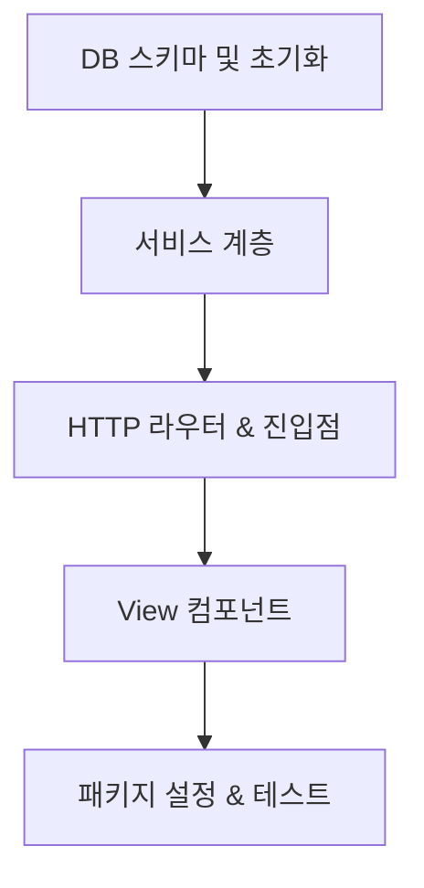

# 🧱 개발 태스크 전략 — The Scripture Shop (성경 쇼핑몰)

> **정경(Bible):** 이 문서는 The Scripture Shop 프로젝트의 개발 태스크 분할 전략서이다.
> 느헤미야의 성벽 재건 방식에 따라 작업 구간을 옳게 분별하여 한 태스크씩 완성해 나간다.

---

## 1. 구현 순서 전략

```
1단계: 기반 — 데이터 모델 & DB 마이그레이션 (TASK-001)
  ↓
2단계: 핵심 — 비즈니스 로직 및 서비스 계층 (TASK-002)
  ↓
3단계: 성문 — HTTP 라우터 및 미들웨어 (TASK-003)
  ↓
4단계: 외벽 — JSX View 템플릿 컴포넌트 (TASK-004)
  ↓
5단계: 시험 — 패키지 설정 및 테스트 실행 명령 구성 (TASK-005)
```

---

## 2. 태스크 분할표

| TASK-ID | 성벽 구간 | 설명 | 연결 REQ | 연결 API/TBL | 생성 파일 | 파일 책임 | 예상 줄수 | 선행 | 규모 | 상태 |
|:---|:---|:---|:---|:---|:---|:---|:---:|:---|:---:|:---:|
| TASK-001 | DB 스키마 및 초기화 | bibles, orders, order_items DDL 및 Seed 주입 | REQ-001, REQ-003 | TBL-001~003 | `fruit-열매/db/client.ts`, `fruit-열매/db/seed.ts` | SQLite DB 초기화 및 커넥션 제공 | ~100 | — | S | ⬜ |
| TASK-002 | 서비스 계층 (Services) | 성경 조회, 주문 생성, 상태변경, 관리자 비즈니스 | REQ-001~005 | TBL-001~003 | `fruit-열매/services/shop.service.ts`, `fruit-열매/services/admin.service.ts` | 비즈니스 로직 캡슐화 및 DB 쿼리 실행 | ~200 | TASK-001 | M | ⬜ |
| TASK-003 | HTTP 라우터 & 진입점 | Hono 라우팅, 쿠키 인증 가드, 장바구니 세션 처리 | REQ-001~005 | API-001~013 | `fruit-열매/routes/shop.ts`, `fruit-열매/routes/admin.ts`, `fruit-열매/index.ts` | HTTP 요청 수신, 쿠키 세션 및 미들웨어, 응답 흐름 제어 | ~280 | TASK-002 | M | ⬜ |
| TASK-004 | View 컴포넌트 (Views) | JSX 기반 HTML 템플릿 레이아웃, 카탈로그, 어드민 UI | REQ-001~005 | SCR-001~005 | `fruit-열매/views/layout.tsx`, `fruit-열매/views/shop.tsx`, `fruit-열매/views/admin.tsx` | HTML 구조 렌더링 및 UI 컴포넌트 구성 | ~350 (전체) | TASK-003 | M | ⬜ |
| TASK-005 | 패키지 설정 & 테스트 | package.json 매니페스트 구성 및 node:test 실행 스크립트 확보 | REQ-001~005 | — | `fruit-열매/package.json`, `fruit-열매/test/app.test.ts` | 프로젝트 의존성 관리 및 통합 테스트 실행 | ~150 | TASK-004 | S | ⬜ |

*각 파일의 단일 책임 원칙을 보장하며 300줄을 초과하는 대대적인 혼합 코드를 방지하도록 역할을 명확히 분리한다.*

---

## 3. 태스크 의존성 맵



---

## 4. 현재 진행 상태

- 모든 태스크는 현재 미착수(`⬜`) 상태이며, TASK-001부터 순차적으로 완성해 나갈 예정이다.
