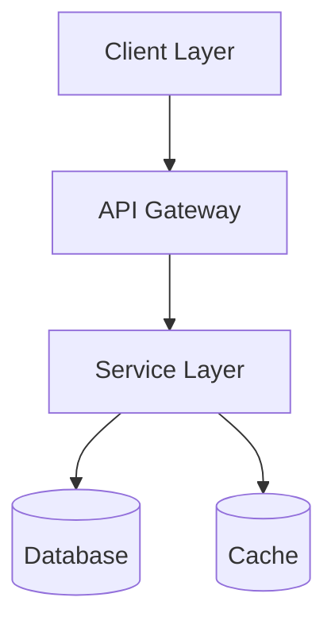
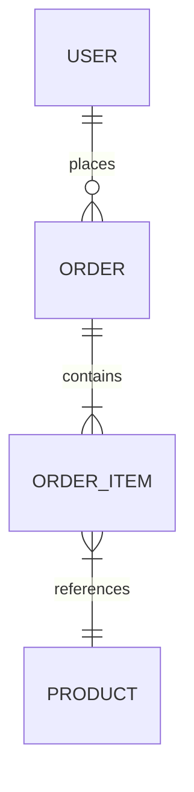
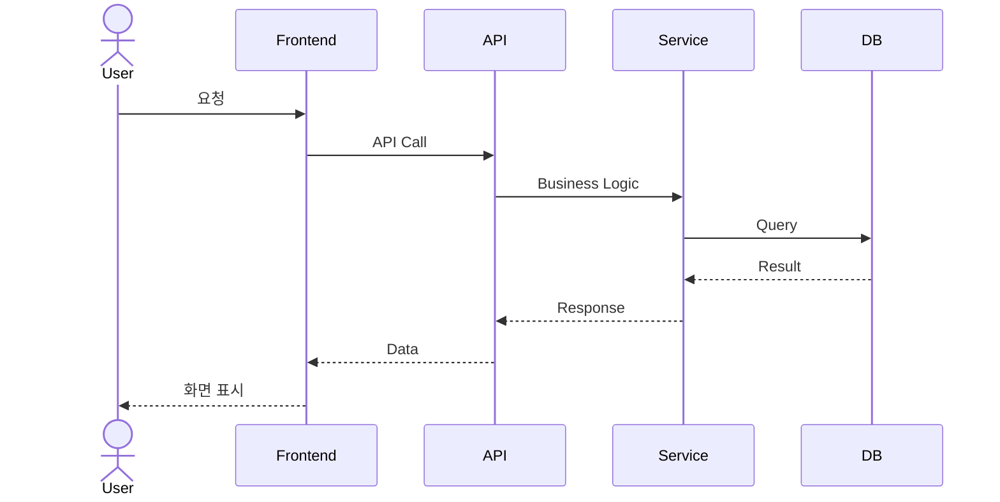

# 🏗️ 시스템 아키텍처 설계서 (System Architecture Document)

> *"And God made the firmament, and divided the waters which were under the firmament from the waters which were above the firmament."* — Genesis 1:7 (KJV)
>
> 궁창(Firmament)은 위와 아래를 나누는 구조이다.
> 아키텍처는 시스템의 궁창 — 모든 것이 올바른 층(Layer)에 위치하도록 나누는 설계이다.

---

## 1. 시스템 개요

| 항목 | 내용 |
|:---|:---|
| 시스템명 | |
| 버전 | v1.0 |
| 작성일 | YYYY-MM-DD |
| 아키텍트 | |
| 상태 | Draft / Review / **Canonized(정경화)** |

---

## 2. 아키텍처 다이어그램

<!-- 전체 시스템 구조도를 삽입하거나 Mermaid로 작성 -->

---

## 3. 기술 스택 (Technology Stack)

| 계층 | 기술 | 버전 | 선택 근거 |
|:---|:---|:---|:---|
| Frontend | | | |
| Backend | | | |
| Database | | | |
| Infra | | | |
| CI/CD | | | |

---

## 4. 데이터 아키텍처 (ERD)

<!-- ERD 다이어그램 삽입 또는 Mermaid erDiagram 작성 -->

### 주요 테이블 정의

| 테이블명 | 설명 | 주요 컬럼 |
|:---|:---|:---|
| | | |

---

## 5. API 명세 (API Specification)

| Method | Endpoint | 설명 | Request | Response | 관련 REQ |
|:---:|:---|:---|:---|:---|:---|
| GET | /api/v1/ | | | | REQ-001 |
| POST | /api/v1/ | | | | REQ-002 |

---

## 6. 시퀀스 다이어그램 (Sequence Diagram)

---

## 7. 보안 아키텍처

> 봉인의 율법(security-seal-봉인) 준수 사항

| # | 보안 항목 | 적용 방식 | 봉인의 율법 근거 |
|:--|:---|:---|:---|
| 1 | 인증 (Authentication) | | 제7계명: 접근 통제 |
| 2 | 인가 (Authorization) | | 제7계명: 최소 권한 |
| 3 | 데이터 암호화 | | 제3계명: 암호화하라 |
| 4 | 시크릿 관리 | | 제2계명: 코드에 넣지 말라 |

---

> **검증:** 이 설계서의 모든 컴포넌트는 RTM에 등재되어 요구사항까지 역추적 가능해야 한다.
