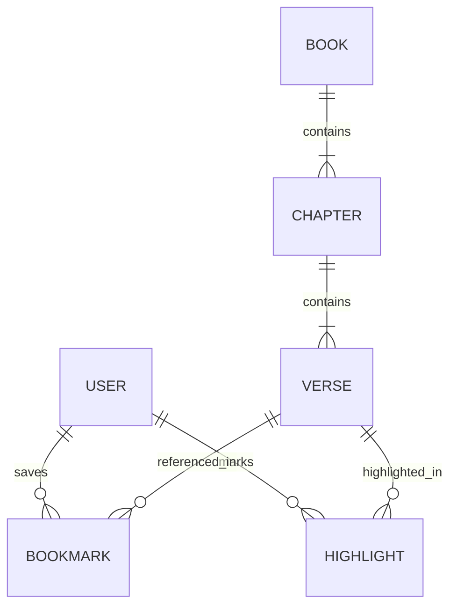

# 🏗️ 시스템 설계서 — 성경 검색 앱 (Example)

> **비유(Parable):** 실제 시스템 설계서가 어떻게 작성되는지 보여주는 **참조 예시**이다.

---

## 1. 시스템 개요

| 항목 | 내용 |
|:---|:---|
| 시스템명 | The Scripture Search |
| 버전 | v1.0 |
| 아키텍트 | Adam (개발 에이전트) |
| 상태 | **Canonized(정경화)** |

---

## 2. 기술 스택

| 계층 | 기술 | 선택 근거 |
|:---|:---|:---|
| Frontend | Next.js 14 | SSR 지원, SEO 최적화 |
| Backend | Node.js + Express | 경량, KJV 텍스트 처리에 적합 |
| Database | PostgreSQL | 풀텍스트 검색(tsvector) 내장 |
| Search | PostgreSQL FTS | 별도 엔진 불필요, 복잡도 최소화 |
| Infra | Vercel + Supabase | 무료 티어 활용, 빠른 배포 |

---

## 3. 폴더 구조 판단

### 판단 체크리스트

| # | 질문 | 답변 | 결과 |
|:--|:---|:---|:---|
| 1 | CRUD가 포함되어 있는가? | ✅ YES (북마크 추가/삭제/목록) | **CRUD 강제 분리 적용** |
| 2 | 화면 수는 몇 개인가? | 5개 (검색·구절상세·로그인·회원가입·북마크) | 4개 이상 → 분리 |
| 3 | 한 파일에 HTTP 처리 + 렌더링이 섞이는가? | YES (분리하지 않으면) | **분리 필수** |

### 판단 결과

- **채택 구조:** HTTP 핸들러 / 화면 템플릿 / 서비스 / DB 4계층 분리
- **판단 근거:** CRUD(북마크) 포함 + 화면 5개 = 체크리스트 #1, #2 모두 분리 조건 충족
- **파일 목록 (역할별 분리):**

```
src/
├── {HTTP 핸들러}/     ← 요청 수신/응답 반환만
│   ├── search         ← 검색 API 처리만
│   ├── auth           ← 인증 API 처리만
│   └── bookmark       ← 북마크 API 처리만
├── {서비스}/           ← 비즈니스 로직만
│   ├── search         ← 검색 로직만
│   ├── auth           ← 인증 로직만
│   └── bookmark       ← 북마크 로직만
├── {화면 템플릿}/      ← UI 렌더링만
│   ├── search         ← 검색 화면만
│   ├── verse          ← 구절 상세 화면만
│   └── login          ← 로그인 화면만
└── {데이터/DB}/
    └── schema         ← DB 스키마 정의만
```

> ⚠️ `{중괄호}`는 기술 스택 컨벤션에 따라 폴더명/파일명을 결정한다.
> (예: Node.js면 routes/ + views/, Java면 controller/ + templates/)
>
> **왜 HTTP 핸들러 안에 화면 렌더링을 넣지 않는가?**
> 북마크 CRUD(목록·추가·삭제)만 해도 각 화면이 별도 렌더링 로직이다.
> HTTP 핸들러에 화면 코드를 넣으면 역할 2개가 혼재 → 파일이 수백 줄로 비대해진다.

---

## 4. ERD



---

## 5. API 명세

| Method | Endpoint | 설명 | 관련 REQ |
|:---:|:---|:---|:---|
| GET | /api/search?q={keyword} | 키워드 검색 | REQ-001 |
| GET | /api/verse/{book}/{chapter}/{verse} | 구절 조회 | REQ-001 |
| POST | /api/bookmarks | 북마크 저장 | REQ-003 |
| DELETE | /api/bookmarks/{id} | 북마크 삭제 | REQ-003 |
| POST | /api/highlights | 하이라이트 저장 | REQ-003 |

---

## 6. 보안 아키텍처

| 봉인 계명 | 적용 |
|:---|:---|
| 제2계명: 코드에 넣지 말라 | DB 접속정보 → Vercel 환경변수 |
| 제3계명: 암호화하라 | 비밀번호 → bcrypt, 통신 → HTTPS |
| 제7계명: 접근 통제하라 | JWT 토큰 + API 미들웨어 |
