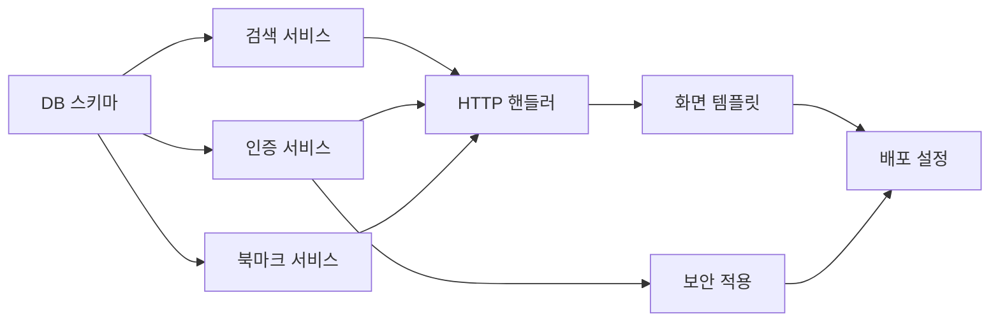

# 🧱 개발 태스크 전략 — 성경 검색 앱 (Example)

> **비유(Parable):** 이 문서는 실제 프로젝트에서 태스크 전략이 어떻게 작성되는지 보여주는 **참조 예시**이다.
> 실제 산출물 작성 시 이것을 참고하고, 규격은 `statute-율법/04/task-wall-성벽-template.md`를 따르라.

---

## 구현 순서 (느헤미야의 성벽 재건 순서)

```
1단계: 기반 — DB 스키마 생성
  ↓
2단계: 핵심 — 비즈니스 로직 (서비스 계층)
  ↓
3단계: 성문 — HTTP 핸들러 (요청 수신/응답 반환만)
  ↓
4단계: 외벽 — 화면 템플릿 (렌더링만, 화면별 파일 분리)
  ↓
5단계: 봉인 — 인증/보안
  ↓
6단계: 파수꾼 — 인프라/배포
```

---

## 태스크 분할표

> ⚠️ **"생성 파일"에 같은 파일이 반복되면 안 된다.**
> 하나의 파일에 여러 TASK를 `(추가)`로 쌓으면 그 파일은 비대해진다.
> **CRUD의 각 화면은 별도 파일이어야 한다.**

| TASK-ID | 성벽 구간 | 설명 | 연결 REQ | 연결 API/TBL | 생성 파일 | 파일의 단일 책임 | 선행 | 규모 | 상태 |
|:---|:---|:---|:---|:---|:---|:---|:---|:---:|:---:|
| TASK-001 | DB 스키마 | 테이블 생성 + 시드 | REQ-001,002 | TBL-001~003 | `{DB 스키마 파일}` | DB 정의 **만** | — | M | ✅ |
| TASK-002 | 검색 서비스 | 키워드 검색 + 구절 조회 | REQ-001 | API-001,002 | `{검색 서비스 파일}` | 검색 비즈니스 로직 **만** | TASK-001 | M | ✅ |
| TASK-003 | 인증 서비스 | 회원가입/로그인 | REQ-002 | API-003,004 | `{인증 서비스 파일}` | 인증 비즈니스 로직 **만** | TASK-001 | M | ✅ |
| TASK-004 | 북마크 서비스 | 북마크 추가/삭제/목록 | REQ-003 | API-005,006 | `{북마크 서비스 파일}` | 북마크 로직 **만** | TASK-001 | S | ✅ |
| TASK-005 | HTTP 핸들러 | 6개 API 엔드포인트 | REQ-001~003 | API-001~006 | `{검색 핸들러}` · `{인증 핸들러}` · `{북마크 핸들러}` | 요청 수신/응답 반환 **만** (도메인별 파일) | TASK-002~004 | M | ✅ |
| TASK-006 | 화면 템플릿 | 검색/상세/로그인 화면 | REQ-001~003 | — | `{검색 화면}` · `{구절 상세 화면}` · `{로그인 화면}` | 렌더링 **만** (화면별 파일) | TASK-005 | L | ✅ |
| TASK-007 | 보안 적용 | 인증 미들웨어 | REQ-002 | — | `{인증 미들웨어 파일}` | 인증 처리 **만** | TASK-003 | S | ✅ |
| TASK-008 | 배포 설정 | 인프라 | — | — | `{배포 설정 파일}` | 인프라 설정 **만** | TASK-006,007 | S | ✅ |

> ⚠️ `{중괄호}`는 기술 스택에 맞는 실제 파일명으로 교체하라.
> AI는 Phase 2(기초)에서 확정된 기술 스택의 공식 컨벤션에 따라 파일명을 결정한다.

---

### ❌ 안 되는 패턴 vs ✅ 올바른 패턴

> 이 원칙은 **모든 언어, 모든 프레임워크에 동일하게 적용된다.**

```
❌ 한 파일에 계속 쌓는 패턴:
   TASK-A: 게시판 목록 → {HTTP 핸들러 파일}
   TASK-B: 게시글 작성 → {HTTP 핸들러 파일} (추가)    ← ⚠️
   TASK-C: 게시글 상세 → {HTTP 핸들러 파일} (추가)    ← ⚠️
   TASK-D: 게시글 수정 → {HTTP 핸들러 파일} (추가)    ← ⚠️
   → 결과: 한 파일이 400줄+ 비대화

✅ 역할별로 분리하는 패턴:
   TASK-A: HTTP 핸들러   → {HTTP 핸들러 파일}     (요청 수신/응답 반환만)
   TASK-B: 목록 화면     → {목록 화면 파일}       (목록 렌더링만)
   TASK-C: 작성/수정 폼  → {폼 화면 파일}         (폼 렌더링만)
   TASK-D: 상세 화면     → {상세 화면 파일}       (상세 렌더링만)
   → 결과: 각 파일 60~100줄, 단일 책임
```

> **핵심:** `(추가)`라는 단어가 태스크 분할표에 나타나면, 그것은 **분리가 필요하다는 신호**다.

---

### TASK-006 서브 태스크 (L 규모 분할)

| TASK-ID | 서브 태스크 | 설명 | 생성 파일 | 상태 |
|:---|:---|:---|:---|:---:|
| TASK-006 | 전체: 화면 템플릿 | 3개 주요 화면 | — | ✅ |
| TASK-006-1 | 검색 화면 | 검색창 + 결과 목록 | `{검색 화면 파일}` | ✅ |
| TASK-006-2 | 구절 상세 화면 | 본문 표시 + 북마크 버튼 | `{상세 화면 파일}` | ✅ |
| TASK-006-3 | 로그인 화면 | 폼 + 유효성 검증 | `{로그인 화면 파일}` | ✅ |

---

## 파일 분리 검증

> **핵심 질문 하나만 기억하라:**
> **"이 파일에 2개 이상의 역할이 섞여 있는가?"**

### 4개 역할 (어떤 언어든 동일)

| 역할 | 책임 | 포함해야 하는 것 | 포함하면 ❌인 것 |
|:---|:---|:---|:---|
| **HTTP 핸들러** | 요청 수신 → 응답 반환 | 파라미터 파싱, 상태코드 결정, 서비스 호출 | HTML 렌더링, DB 쿼리 |
| **화면 템플릿** | UI 렌더링 | HTML 구조, 조건부 표시, 데이터 바인딩 | HTTP 처리, 비즈니스 로직 |
| **서비스/비즈니스** | 비즈니스 규칙 | 검증, 계산, 트랜잭션 | HTTP 처리, HTML 렌더링 |
| **데이터/DB** | 데이터 저장/조회 | SQL, ORM 쿼리, 스키마 정의 | HTTP 처리, HTML 렌더링 |

### 분리 검증표 작성법

```markdown
| 파일 | 역할 | 다른 역할 침범? | 판정 |
|:---|:---|:---:|:---|
| {HTTP 핸들러 파일} | HTTP 핸들러 | ❌ 없음 | ✅ 단일 책임 |
| {목록 화면 파일}   | 화면 템플릿 | ❌ 없음 | ✅ 단일 책임 |
| {서비스 파일}      | 비즈니스    | ❌ 없음 | ✅ 단일 책임 |
| {DB 파일}          | 데이터/DB   | ❌ 없음 | ✅ 단일 책임 |
```

> **침범 예시:**
> - HTTP 핸들러 파일에 `<html>` 또는 JSX가 있음 → **화면 템플릿 역할 침범** → ❌ 분리 필요
> - 화면 템플릿 파일에 SQL 쿼리가 있음 → **데이터 역할 침범** → ❌ 분리 필요
> - 서비스 파일에 `request.param`이 있음 → **HTTP 핸들러 역할 침범** → ❌ 분리 필요

---

## 태스크 의존성 맵



> ✅ 8개 태스크, 느헤미야의 원칙대로 구간을 나누어 쌓았다.
> **모든 파일이 단일 책임. 같은 파일에 `(추가)`로 쌓는 패턴 0건.**
